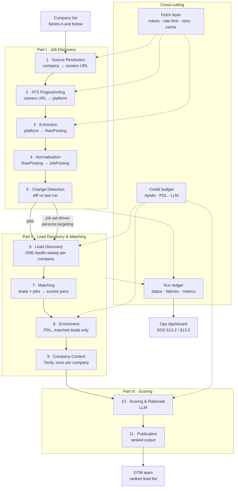

# GTM Lead Discovery Agent — Design Specification

**Status:** Draft for engineering review
**Companion to:** `SDD_GTM_Lead_Discovery_Agent (2).docx` — this document is the engineering specification behind it
**Scope:** Design specification. Pseudocode only, no production code.
**Target stack:** Python 3.11+ · httpx · selectolax · Playwright · Pydantic · PostgreSQL
**External services:** Apollo (lead discovery) · People Data Labs (enrichment) · Tavily (company context) · LLM (scoring)

---

## Table of Contents

**Foundations**
1. [Purpose & Scope](#1-purpose--scope)
2. [Design Principles](#2-design-principles)
3. [Architecture](#3-architecture)

**Part I — Job Discovery**
4. [Stage 1 — Source Resolution](#4-stage-1--source-resolution)
5. [Stage 2 — ATS Fingerprinting](#5-stage-2--ats-fingerprinting)
6. [Stage 3 — Extraction](#6-stage-3--extraction)
7. [Stage 4 — Normalisation](#7-stage-4--normalisation)
8. [Stage 5 — Change Detection & Identity](#8-stage-5--change-detection--identity)

**Part II — Lead Discovery & Matching**
9. [Stage 6 — Lead Discovery](#9-stage-6--lead-discovery)
10. [Stage 7 — Lead–Job Matching](#10-stage-7--leadjob-matching)
11. [Stage 8 — Enrichment](#11-stage-8--enrichment)
12. [Stage 9 — Company Context](#12-stage-9--company-context)

**Part III — Scoring & Output**
13. [Stage 10 — Scoring, Rationale & Ranking](#13-stage-10--scoring-rationale--ranking)
14. [Stage 11 — Publication & Output Contract](#14-stage-11--publication--output-contract)

**Part IV — Cross-Cutting**
15. [Data Model](#15-data-model)
16. [Orchestration & Scheduling](#16-orchestration--scheduling)
17. [Failure Taxonomy](#17-failure-taxonomy)
18. [Cost & Credit Model](#18-cost--credit-model)
19. [Observability & Metrics](#19-observability--metrics)
20. [Testing Strategy](#20-testing-strategy)
21. [Compliance & Politeness](#21-compliance--politeness)
22. [Phased Rollout](#22-phased-rollout)
23. [Open Questions](#23-open-questions)

**Appendices**
- [Appendix A — ATS Platform Reference](#appendix-a--ats-platform-reference)
- [Appendix B — Why LinkedIn Is Out of Scope](#appendix-b--why-linkedin-is-out-of-scope)
- [Appendix C — Persona Ladder Reference](#appendix-c--persona-ladder-reference)

---

## 1. Purpose & Scope

### 1.1 What the agent does

The GTM Lead Discovery Agent takes a list of target companies — Series A and below — and returns a ranked list of hiring leads, each tied to a specific open role, with a relevance score, a confidence score, and a short rationale.

It works in three movements:

```
                    ┌─────────────────────────────────────────┐
Company list  ─────►│ PART I   Find every open job            │  careers-page / ATS scrape
                    │          per company                    │
                    └────────────────┬────────────────────────┘
                                     │ jobs[]
                    ┌────────────────▼────────────────────────┐
                    │ PART II  Find every relevant lead        │  Apollo, once per company
                    │          per company, then MATCH         │  match leads → jobs
                    │          leads to jobs                   │  PDL enrich · Tavily context
                    └────────────────┬────────────────────────┘
                                     │ (job, lead) pairs
                    ┌────────────────▼────────────────────────┐
                    │ PART III Score, explain, rank            │  LLM
                    └────────────────┬────────────────────────┘
                                     ▼
                          Ranked, GTM-ready lead list
```

**The ordering in the middle movement is the design's central structural decision.** Leads are discovered **once per company**, not once per job, and matching to jobs happens afterwards as a local operation over data we already hold. §2.7 explains why; §10 specifies the matching itself.

### 1.2 What each stage contributes

| Part | Stage | Question answered | Source |
| --- | --- | --- | --- |
| I | 1–2 Source resolution & fingerprinting | Where does this company post jobs? | Web, ATS detection |
| I | 3–4 Extraction & normalisation | What roles are open? | ATS APIs, JSON-LD, HTML |
| I | 5 Change detection | What's *newly* open? | Local diff |
| II | 6 Lead discovery | Who at this company could own hiring? | Apollo People Search |
| II | 7 Matching | Which of them owns *this specific role*? | Local scoring + LLM |
| II | 8 Enrichment | What else do we know about them? | PDL |
| II | 9 Company context | Is this a good target right now? | Tavily |
| III | 10 Scoring & ranking | How relevant, how confident, and why? | LLM |
| III | 11 Publication | — | Output contract |

### 1.3 Recall is set at Part I

**A job we fail to discover is a lead we never look for.** No amount of matching or enrichment quality compensates for a missed posting — the pipeline never learns the role exists, and produces no leads for it without any signal that something is missing. Recall at Part I caps the recall of the entire system, which is why it occupies the largest share of this specification.

Precision, by contrast, is set at Part II. A wrong lead is visible and correctable; a missing job is neither.

### 1.4 Why scraping at all

Neither Apollo nor People Data Labs is a job-postings source. Job aggregators exist, but for the target segment — Series A and below — their coverage is materially incomplete and typically lags the source by days. Early-stage startups post roles on their own careers page first and often *only* there. The company's own careers presence is the authoritative source, so we read it directly.

### 1.5 Why Series A and below

The segment ceiling is not arbitrary; it's what makes this component tractable:

| Property of the segment | Consequence for the design |
| --- | --- |
| Few open roles per company (typically 1–30) | A complete scrape is cheap; no deep pagination |
| Overwhelmingly use a hosted ATS rather than a bespoke portal | The dominant path is an API call, not HTML parsing (see §2.1) |
| Weakest coverage from existing job data vendors | Highest marginal value from building this |
| Simple, low-traffic sites | Politeness budget is easy to respect |

Above Series A the economics invert: companies run bespoke, heavily-defended, JavaScript-rendered career portals with hundreds of roles, and commercial data coverage is already good. Those companies are explicitly out of scope.

### 1.6 Explicitly out of scope

- **LinkedIn.** See [Appendix B](#appendix-b--why-linkedin-is-out-of-scope) for the reasoning and the licensed alternative.
- **Job aggregators** (Indeed, Glassdoor, Wellfound, etc.) — both as sources and as fallbacks.
- **Companies above Series A.**
- **Any candidate or applicant data.** The agent reads job postings and identifies *hiring-side* professionals. It never touches applicant or candidate information.
- **Generating the target company list.** That is an input, per SDD §3.
- **Anti-bot circumvention.** A site that blocks us is recorded as blocked. See §2.5 and §21.
- **Outreach itself.** The agent produces a ranked list. Sending anything is a human decision and a separate system (SDD §16, future enhancements).

---

## 2. Design Principles

### 2.1 ATS-API-first, HTML second

**This is the single most important decision in the document, and it inverts the naive design.**

The intuitive reading of "scrape careers pages" is: fetch HTML, parse the DOM, extract job links. That approach is brittle, slow, expensive, and — for this segment — mostly unnecessary.

Early-stage startups do not build careers pages. They sign up for an Applicant Tracking System, and the ATS hosts the job board. `company.com/careers` is usually one of:

- a redirect to `jobs.lever.co/company` or `boards.greenhouse.io/company`
- a page whose entire content is an iframe or JS widget pointed at the ATS
- a thin custom page that fetches from the ATS at runtime

Every major ATS in this segment exposes a **public, documented, stable JSON endpoint** for its job boards — because the boards are meant to be embedded and syndicated. These endpoints return clean structured data: title, location, department, full description, a stable job ID, often a posting timestamp.

The consequence:

> For the majority of target companies, job discovery is *identify which ATS the company uses, then make one authenticated-by-nothing JSON request*. HTML parsing is the fallback for the tail, not the main path.

This changes nearly every property of the system:

| | Naive HTML-first | ATS-API-first |
| --- | --- | --- |
| Breakage mode | Any CSS change breaks it | Only ATS API version changes break it — rare and usually announced |
| Maintenance | Per-company selectors | Per-ATS adapters — a handful, covering thousands of companies |
| Data quality | Whatever's rendered; descriptions need a second fetch and cleaning | Structured fields, descriptions usually inline |
| Job identity | Content hashing, fragile | Stable ATS-native IDs |
| Cost | Headless browser per company | One HTTP request |
| Politeness | Many requests against small sites | One request against a CDN-fronted API built to serve them |

A useful reframing: **the "scraper" is mostly an integration layer, and only occasionally a scraper.** Budget engineering effort accordingly — the adapters are the product, the HTML fallback is the safety net.

### 2.2 One interface, many backends

Every extraction path — ATS API, JSON-LD, rendered DOM — implements one adapter interface (§6.1). The orchestrator never knows which path served a company. This is what lets us add an ATS, change a parsing strategy, or later swap in a licensed data feed without touching anything upstream or downstream. It's also the concrete implementation of the SDD's stated principle that any data source can be replaced independently.

### 2.3 "Scrape failed" is never "no open jobs"

These two states are semantically opposite and must never be merged:

- **No open jobs** — we successfully read the company's board and it is empty. This is real information: the company isn't hiring. Downstream correctly produces no leads.
- **Scrape failed** — we don't know what the company's board says. This is an *absence of information*.

Collapsing the second into the first produces a silent, systematic, and invisible failure: a company drops out of the pipeline and looks like a legitimate negative. Nobody investigates a "not hiring" result.

Every terminal state in §17 is therefore explicitly typed, persisted, and surfaced. A run reports `47 companies scraped, 3 unscraped` — never `47 companies scraped` alone.

### 2.4 Runs are idempotent

Re-running against the same company on the same day produces the same job set and no duplicate downstream events. This makes retries safe, partial failures recoverable, and backfills routine. Identity (§8.1) is what makes it work.

### 2.5 Politeness is a correctness property

Rate limiting, robots.txt compliance, and honest identification are usually framed as ethics. They are also engineering:

- A polite crawler doesn't get blocked, so it keeps working.
- An honest User-Agent gives a site owner someone to contact instead of a reason to ban a subnet.
- Respecting `Retry-After` and backing off is how you stay under a threshold you can't see.

We do not fingerprint-spoof, rotate residential proxies, or solve challenges. Beyond the legal and ethical objections, evasion is an arms race with a well-resourced opponent and it produces a system whose failures are invisible — precisely the property §2.3 exists to prevent.

### 2.6 Provenance on every field

Each normalised field records where it came from and how confident we are. `location: "Remote (US)"` derived from a regex over a title is not the same fact as `location` returned by the Greenhouse API. Downstream LLM scoring should be able to see the difference, and debugging is impossible without it.

### 2.7 Discover leads per company, match to jobs locally

**This is the second load-bearing decision in the design, and it diverges from the SDD.**

SDD §6 step 4 reads: *"Agent calls the Apollo People Search API to identify the most relevant hiring leads or decision makers for each open job."* Read literally, that means one Apollo search per job. This specification does it differently: **one Apollo sweep per company, then match locally.**

The reason is that a company's relevant people are a small, stable set, while its open roles are a larger and more volatile one. Searching per job re-fetches almost the same people repeatedly:

| | Per-job search (SDD literal) | Per-company sweep, then match |
| --- | --- | --- |
| Apollo calls for a company with 12 jobs | ~12 searches, heavily overlapping | 1 search |
| Credit cost | Scales with **jobs × companies** | Scales with **companies** |
| Same person surfaced for 6 roles | Fetched 6 times, deduped after the fact | Fetched once |
| New job appears tomorrow | Full new search | Match against the cached lead set — **zero API cost** |
| Matching logic | Implicit in the query filters, invisible | Explicit, inspectable, testable, tunable |
| Failure mode | A bad query silently returns the wrong people | A bad match is visible in the score and rationale |

The last row matters most. When the search *is* the matching, you cannot inspect why a lead was chosen — the reasoning is dissolved into query parameters. Separating retrieval from matching makes the matching a first-class, testable component with explicit signals (§10.3), which is what lets it be tuned against feedback later.

The incremental case is the strongest argument. Most sweeps discover a handful of new jobs at companies we already know. Under per-company caching, those new jobs cost **zero** lead-discovery credits — they match against a lead set we already hold. Under per-job search, every new job is a fresh paid search. Given daily sweeps over a growing list, that difference compounds into the dominant cost term.

*Recommendation: update SDD §6 step 4 to reflect this ordering.*

### 2.8 Cheap signals before expensive ones

Every stage in Part II is ordered so that free, local, deterministic work runs before paid or non-deterministic work:

```
rules-based match scoring   (free, local, instant)
        ↓ survivors only
PDL enrichment              (credits — only for leads that matched something)
        ↓ enriched
Tavily company context      (1 call per company, not per lead)
        ↓
LLM scoring & rationale     (tokens — only for pairs above the match floor)
```

The alternative — enrich everything, then decide what's relevant — spends the majority of the budget on leads that are discarded. Filtering first is what keeps per-company cost roughly flat as the lead set grows.

### 2.9 Say "we don't know" rather than guess

Per SDD §6: if a job has no clearly relevant lead, return it with a **low confidence score** rather than inventing one. This applies throughout Part II:

- A job with no plausible owner gets an empty lead set and an explicit `no_lead_found` reason — not the least-bad person in the company.
- A lead matched only by weak signals carries low confidence, and the rationale says which signals were weak.
- The LLM is instructed to score low when evidence is thin, and its rationale must cite the specific match signals it was given (§13.4). A confident-sounding rationale for a bad match is worse than an honest low score, because it launders a guess into an assertion the GTM team will act on.

---

## 3. Architecture

### 3.1 Pipeline stages



### 3.2 Stage contracts

Each stage has a narrow, testable contract. Stages are separately runnable, which matters for backfills and for debugging a single company.

| Stage | Input | Output | Persisted? | Cost per company |
| --- | --- | --- | --- | --- |
| 1 · Source Resolution | `Company(name, domain)` | `CareersSource(url, confidence)` | Yes — long-lived | Once per company, rarely re-run |
| 2 · ATS Fingerprinting | `CareersSource` | `AtsIdentification(platform, board_token, confidence)` | Yes — long-lived | Once per company, re-verified periodically |
| 3 · Extraction | `AtsIdentification` | `list[RawPosting]` | Raw payload archived | 1 request per sweep |
| 4 · Normalisation | `RawPosting` | `JobPosting` | Yes | Free, local |
| 5 · Change Detection | `list[JobPosting]` + prior state | `list[JobEvent]` | Yes | Free, local |
| 6 · Lead Discovery | `Company` + `list[JobPosting]` | `list[Lead]` | Yes — cached | **1 Apollo sweep**, cached across sweeps |
| 7 · Matching | `list[Lead]` × `list[JobPosting]` | `list[LeadJobMatch]` | Yes | Free, local (+ optional LLM tie-break) |
| 8 · Enrichment | `LeadJobMatch` above floor | enriched `Lead` | Yes — cached | PDL credits, matched leads only |
| 9 · Company Context | `Company` | `CompanyContext` | Yes — cached | 1 Tavily call, cached ~7 days |
| 10 · Scoring | match + lead + job + context | `ScoredLead` | Yes | LLM tokens, per pair above floor |
| 11 · Publication | `list[ScoredLead]` | ranked output | Yes | Free |

### 3.3 What is cached versus what recurs

This is the property that determines the agent's marginal cost, and it's worth stating plainly:

| Cached, computed roughly once | Recurs every sweep |
| --- | --- |
| Careers source + ATS identification (stages 1–2) | Job extraction (stage 3) — 1 cheap request |
| **Lead set per company (stage 6)** | Normalisation, change detection (4–5) — free |
| PDL enrichment per lead (stage 8) | Matching (stage 7) — free |
| Tavily context per company (stage 9, ~7d TTL) | Scoring for *new* pairs only (stage 10) |

**The steady-state cost of a sweep over a known company with no new jobs is one HTTP request** — or zero, if a conditional request returns 304 (§6.3). A company with one new job costs one request plus the matching and scoring of that single job against an already-cached lead set. No Apollo call, no PDL call, no Tavily call.

That property is what makes daily sweeps over a large list affordable, and it follows directly from §2.7 and §2.8.

### 3.4 Re-verification triggers

Cached artefacts are recomputed when:

| Artefact | Recomputed on |
| --- | --- |
| Careers source / ATS ID | Extraction failure · `zero_jobs_suspicious` · 90-day staleness |
| Company lead set | New job whose function has no matching persona · 30-day staleness · headcount change signal |
| PDL enrichment | 90-day staleness · lead job-change signal |
| Tavily context | 7-day staleness · funding-event signal |

---

# Part I — Job Discovery

*Stages 1–5. From a company list to a normalised, deduplicated, change-tracked set of open roles. Recall here caps the recall of the whole agent (§1.3).*

---

## 4. Stage 1 — Source Resolution

**Goal:** from `(company_name, domain)` to a canonical careers URL, with a confidence score.

This stage is run once per company and the result is persisted. Getting it wrong is expensive — a wrong careers URL produces a confident, plausible, entirely incorrect job set (e.g. resolving to a parent company or a similarly-named firm).

### 4.1 Resolution ladder

Strategies are attempted in order of decreasing reliability. The first result above the confidence floor wins; results are recorded with the strategy that produced them.

**Strategy A — Homepage link extraction (preferred)**

Fetch the company homepage, extract all anchors, and score them for "careers-ness" by link text, `href` path, and location in the DOM (footer navigation is a strong positive signal).

```
fetch(domain) → parse anchors
score(anchor):
    +5  link text matches /careers?|jobs|join us|we'?re hiring|work with us|open roles/i
    +4  href path matches /careers?|jobs|join|hiring|opportunities/
    +5  href host is a known ATS domain          ← strongest single signal
    +2  anchor is inside <footer> or main <nav>
    -3  href points to a blog post or news article path
    -5  link text suggests a job board listing for other companies
pick highest-scoring above threshold
```

Preferred over path probing because it reflects what the company actually links to, and because an anchor pointing straight at `jobs.lever.co/acme` resolves stages 1 *and* 2 in a single fetch.

**Strategy B — Conventional path probing**

If the homepage yields nothing, probe conventional paths with `HEAD` (falling back to `GET` where `HEAD` is unsupported, which is common):

```
/careers   /career    /jobs      /join      /join-us
/hiring    /work-with-us         /about/careers
/company/careers      /en/careers
```

Accept only 2xx, and validate the landing page actually looks like a careers page before accepting — a catch-all route returning 200 for everything is a common trap. Probe sequentially with rate limiting, not in parallel; a burst of 11 requests against a small startup's origin is exactly the behaviour §2.5 rules out.

**Strategy C — sitemap.xml**

Fetch `/sitemap.xml` (and any sitemap index it points to), filter URLs by careers-like path patterns. Effective on marketing sites built with static generators, which is a large share of this segment. Cheap and high-precision when present.

**Strategy D — Tavily search fallback**

Per SDD §12, fall back to a Tavily query: `"{company_name}" careers open positions site:{domain}`, then `"{company_name}" jobs` without the site restriction. Domain-restrict first — the unrestricted query is prone to returning an aggregator's page *about* the company rather than the company's own board, which is a silent correctness failure. Validate any unrestricted result's host against the known company domain and ATS domain list before accepting.

**Strategy E — Manual override**

An operator-supplied URL in the company record short-circuits the entire ladder. Necessary for the tail, and the pragmatic answer to any company the automation can't resolve. Manual entries are flagged and never overwritten by automated resolution.

### 4.2 Validation

Before persisting, confirm the resolved page is plausibly a careers page:

- contains job-board-like markers (multiple links matching job-detail URL patterns, an ATS embed, or `schema.org/JobPosting` JSON-LD), **or**
- is itself on a known ATS domain, **or**
- contains careers-page copy signals (`open positions`, `join our team`, `current openings`)

Pages failing all three are recorded as `resolution_unvalidated` and queued for manual review rather than accepted.

### 4.3 Confidence scoring

| Signal | Confidence |
| --- | --- |
| Manual override | 1.00 |
| Homepage link → known ATS domain | 0.95 |
| Homepage link → own-domain careers path, validated | 0.85 |
| Conventional path probe, validated | 0.75 |
| Sitemap match, validated | 0.75 |
| Tavily domain-restricted, validated | 0.60 |
| Tavily unrestricted, validated | 0.40 — review before use |

Below 0.50 the source is stored but flagged `needs_review` and excluded from automated runs until confirmed.

### 4.4 Edge cases

| Case | Handling |
| --- | --- |
| Careers page on a different domain (`acme.com` → `acmehq.io/careers`) | Accept if reachable from the homepage; record the cross-domain hop explicitly |
| Company uses a Notion / Coda / Google Doc page as its board | Common at pre-seed. Route to the generic-HTML adapter; often needs rendering. Flag as `low_structure` |
| No careers page at all | Terminal state `no_careers_page`. Legitimately common at this stage — a 4-person company may genuinely have no board |
| Careers page exists but is "no open roles right now" | This is a **successful scrape with zero jobs** — a real negative, not a failure. Critical distinction per §2.3 |
| Domain parked, expired, or company dead | Terminal `domain_unreachable`; signal back to the company list owner — the target list has stale entries |
| Multiple careers pages (regional boards) | Record all; extraction unions across them and dedups |

---

## 5. Stage 2 — ATS Fingerprinting

**Goal:** identify which ATS hosts the company's board, and extract the board identifier needed to call its API.

### 5.1 Detection signals

Signals are checked in confidence order. Multiple corroborating signals raise confidence; the highest-confidence single signal is usually decisive.

1. **URL host match** — the careers URL is already on an ATS domain (`jobs.lever.co`, `boards.greenhouse.io`, `jobs.ashbyhq.com`, `apply.workable.com`). Decisive. Board token is in the path.
2. **Redirect target** — `company.com/careers` 30x-redirects to an ATS domain. Decisive.
3. **Embedded script / iframe src** — the page loads `boards.greenhouse.io/embed/job_board/js`, `cdn.lever.co/…`, `embed.ashbyhq.com/…`. Decisive; the board token is in the URL or an adjacent `data-` attribute.
4. **DOM markers** — container elements with ATS-specific IDs or class prefixes (`#grnhse_app`, `.lever-job`, `[data-ashby-*]`). Strong.
5. **Network requests during render** — if the page had to be rendered, inspect XHR targets. Strong, and catches JS-injected boards that leave no static markers.
6. **DNS / CNAME** — `careers.company.com` CNAME'd to an ATS host. Moderate; useful for white-labelled boards.

### 5.2 Board token extraction

Each platform identifies a board by a token embedded in the URL. Extraction is a per-platform regex against the resolved URL or the embed script src. The token is persisted alongside the platform — it is the durable key that makes every subsequent run a single API call.

Token extraction is the highest-value output of this stage. Once you hold `(platform, board_token)` you no longer need the careers page at all.

### 5.3 Routing

```
identify(source) → AtsIdentification(platform, board_token, confidence)

if platform in ATS_ADAPTERS and confidence >= 0.8:
    → ATS API adapter                   # dominant path
elif page contains schema.org/JobPosting JSON-LD:
    → structured-HTML adapter           # high-yield second path
elif page requires rendering:
    → rendered-DOM adapter
else:
    → generic-HTML adapter              # terminal fallback
```

Fingerprinting is cached with the source record and re-verified on extraction failure or after the staleness timer. **A company migrating ATS is the most common cause of a sudden zero-job result**, and re-fingerprinting on that trigger is what catches it — see §17.

> **Build note:** the specific endpoint shapes in [Appendix A](#appendix-a--ats-platform-reference) are documented from public ATS board APIs, but each must be verified against current vendor documentation before implementation. These are third-party APIs and shapes drift. Treat the appendix as a starting map, not a contract.

---

## 6. Stage 3 — Extraction

**Goal:** produce a list of `RawPosting` from an identified source, preserving the original payload.

### 6.1 The adapter interface

Every extraction path implements the same two-method interface:

```python
class BoardAdapter(Protocol):
    platform: str

    def discover(self, source: CareersSource) -> list[RawPosting]:
        """Return every currently-open posting. May return shallow records."""

    def hydrate(self, posting: RawPosting) -> RawPosting:
        """Fill in full description and detail fields. No-op if discover() was complete."""
```

The `discover` / `hydrate` split exists because platforms differ in whether the list endpoint includes full descriptions:

- **Inline** (Greenhouse with `content=true`, Lever): `discover` returns everything; `hydrate` is a no-op. One request per company.
- **Two-phase** (most HTML boards, some ATS list endpoints): `discover` returns titles and URLs; `hydrate` fetches each job detail page. N+1 requests per company.

Because the segment averages few roles per company, even the N+1 path is bounded — but the orchestrator should still prefer inline where a platform offers it, and hydration should run only for postings that are new or changed since the last run (§8), not for the whole board every time.

### 6.2 Adapter families

**6.2.1 ATS-API adapters** — the primary path

One adapter per platform. Each handles that platform's endpoint shape, pagination model, and quirks. Returns structured JSON; no HTML parsing.

Characteristics: fast, stable, high-fidelity, polite (served by the ATS's CDN, not the startup's origin). Failure mode is API version change — rare, usually announced, and detected immediately by schema validation.

**6.2.2 Structured-HTML adapter** — `schema.org/JobPosting` JSON-LD

Higher-yield than its obscurity suggests. Job boards embed `JobPosting` JSON-LD to qualify for Google Jobs indexing, which is a strong commercial incentive — so a meaningful share of even bespoke careers pages carry clean, schema-conformant structured data.

```
parse page → extract <script type="application/ld+json">
           → filter objects where @type == "JobPosting"
           → map schema fields to RawPosting
```

Schema.org's `JobPosting` maps almost directly onto our target schema: `title`, `description`, `datePosted`, `validThrough`, `employmentType`, `jobLocation`, `hiringOrganization`, `baseSalary`, `jobLocationType`. When present, this path yields near-ATS quality without an ATS.

**Always attempt JSON-LD extraction before falling back to DOM parsing**, including on pages that were rendered — it costs one parse of already-fetched content and frequently obviates the harder path.

**6.2.3 Rendered-DOM adapter** — Playwright

For boards that exist only after JavaScript execution and expose no ATS API. Expensive (a browser context per company) and slowest, so it is gated behind a detection check rather than used by default.

Detection: fetch statically first; if the response contains no job-like content but does contain a known SPA root or an ATS embed script, escalate to rendering.

Rendering discipline:
- Block images, fonts, media, and analytics at the request level — a large speed and memory win
- Wait on a content-presence condition (job-like elements appear), not a fixed sleep, with a hard timeout ceiling
- **Capture the XHR/fetch requests the page makes.** Frequently the page calls a clean JSON endpoint we can call directly on subsequent runs — promoting the company from the expensive rendered path to a cheap direct path. This "render once, learn the endpoint, never render again" pattern should be an explicit feature, and it is the main reason the rendered adapter earns its cost
- Reuse a browser instance across companies with a fresh context each; never a fresh browser per company

**6.2.4 Generic-HTML adapter** — terminal fallback

Heuristic DOM extraction for the residue. Find repeated structural elements containing job-like links, cluster by DOM path, extract title/location/URL by positional and textual heuristics.

This path is **low-confidence by construction.** It is a best-effort net, not a reliable extractor. Results are marked `parse_degraded`, carry reduced confidence, and — for a company that has *never* successfully parsed by any other path — should be surfaced for human confirmation before being trusted as a complete job set. Do not let heuristic output masquerade as authoritative.

### 6.3 Fetch layer

Shared by every stage that touches the network. Centralising this is what makes politeness enforceable rather than aspirational — no adapter gets its own HTTP client.

| Concern | Approach |
| --- | --- |
| Client | Single `httpx.AsyncClient`, HTTP/2 on, connection pooling, sane pool limits |
| Timeouts | Separate connect / read / total budgets; total ceiling per request |
| Concurrency | Global pool cap, plus a **per-domain semaphore of 1–2** — the per-domain limit is the one that matters for politeness |
| Rate limit | Minimum delay between requests to the same host, with jitter. ATS API hosts get a higher allowance than startup origins; they are built for volume |
| Retry | Jittered exponential backoff on 5xx, 429, and connection errors. Bounded attempts. Honour `Retry-After` when present. **Never retry 401/403/404** — those are answers, not failures |
| Conditional requests | Store `ETag` / `Last-Modified`; send `If-None-Match` / `If-Modified-Since`. A 304 means "board unchanged" — skip the entire downstream pipeline for that company. Large saving on frequent runs |
| Caching | Content-addressed raw-payload cache keyed by URL + run window. Makes re-runs free and lets normalisation be re-run offline against archived payloads without re-fetching — invaluable for parser development |
| robots.txt | Fetched and cached per host; consulted before every request; see §21 |
| User-Agent | Honest and static: identifies the tool, its purpose, and a contact address |
| Compression | Accept gzip/brotli |
| Redirects | Followed with a bounded chain; final URL recorded (a redirect to an ATS is a fingerprinting signal) |

### 6.4 Raw payload archival

Every successful extraction archives its raw payload (JSON body or HTML) to object storage, keyed by `(company_id, run_id)`.

This is not optional bookkeeping. It enables:
- Re-running normalisation offline after a parser fix, without re-fetching — the single biggest accelerator for parser development
- Diagnosing "why did this company return zero jobs on Tuesday" after the fact
- Regression-testing parser changes against real historical payloads
- Building the fixture corpus in §20 from production traffic rather than by hand

Retention: 90 days rolling, or indefinitely for payloads promoted into the fixture corpus.

---

## 7. Stage 4 — Normalisation

**Goal:** `RawPosting` (platform-shaped) → `JobPosting` (canonical), with provenance and confidence on every derived field.

### 7.1 Canonical `JobPosting` schema

```python
class JobPosting(BaseModel):
    # Identity
    job_id: str                    # stable internal ID — see §8.1
    company_id: str
    source_job_id: str | None      # ATS-native ID when available
    source_platform: str           # greenhouse | lever | ashby | jsonld | generic_html | ...
    posting_url: HttpUrl           # canonical public URL for this role

    # Core content
    title_raw: str                 # exactly as posted — never overwritten
    title_canonical: str           # normalised
    description_text: str          # plain text
    description_markdown: str      # structure-preserving
    department_raw: str | None
    function: str | None           # engineering | sales | product | ...
    seniority: str | None          # intern … executive

    # Location
    location_raw: str | None
    locations: list[Location]      # parsed; a role may list several
    workplace_type: str | None     # onsite | hybrid | remote
    remote_scope: str | None       # e.g. "US", "EMEA", "global"

    # Terms
    employment_type: str | None    # full_time | part_time | contract | internship
    compensation: Compensation | None

    # Timing
    posted_at: datetime | None
    posted_at_is_inferred: bool
    first_seen_at: datetime        # our observation, always known
    last_seen_at: datetime
    closed_at: datetime | None

    # Quality
    field_provenance: dict[str, Provenance]
    extraction_confidence: float
    is_degraded: bool              # generic-HTML path — treat with suspicion
```

**`title_raw` is never overwritten.** Every downstream consumer — especially the LLM doing lead scoring — should have access to exactly what the company wrote. Canonicalisation is additive.

### 7.2 Title canonicalisation

Startup job titles are noisy: `"Senior Software Engineer, Backend (Remote - US) 🚀"`.

Pipeline: strip emoji and decorative characters → strip trailing location parentheticals → strip req IDs → collapse whitespace → normalise separators → expand common abbreviations (`Sr.` → `Senior`, `Eng` → `Engineer`) → title-case only if the original was not intentionally cased.

Conservative by design. Over-normalisation destroys signal — `"Founding Engineer"` and `"Engineer"` are genuinely different roles at this stage, and flattening them loses exactly the information a GTM team cares about.

### 7.3 Function and seniority classification

**Rules first, LLM for the residue.** A curated keyword-and-pattern classifier resolves the large majority of titles deterministically, at zero cost, with reproducible output. Only titles the rules fail to classify go to an LLM call, and results are cached by canonical title so each distinct title is classified once ever.

This ordering matters: it keeps cost near zero, keeps behaviour reproducible in tests, and means an LLM outage degrades the classifier rather than stopping the pipeline.

- **Function:** engineering, product, design, data, sales, marketing, customer success, operations, finance, people, legal, other
- **Seniority:** intern, entry, mid, senior, staff, principal, lead, manager, director, vp, executive, founding

`founding` is deliberately a seniority value rather than a modifier — at this segment "Founding Engineer" is a distinct and highly relevant category for GTM targeting.

### 7.4 Location parsing

`location_raw` → structured `Location(city, region, country, is_remote)`.

Handles: multi-location strings (`"NYC / SF / Remote"` → three entries), remote qualifiers (`"Remote (US only)"` → remote with scope), hybrid signals (`"Hybrid — 3 days in London"`), country-only and region-only values, and non-English location names.

**Workplace type resolution** draws on the location string, the title, *and* the description body — the description is often the only place hybrid expectations are stated, and it's the field most likely to contradict a location string that just says "London." Where signals conflict, prefer the description, record the conflict in provenance, and lower confidence.

### 7.5 Compensation extraction

Extracted only when explicitly posted; never inferred. Increasingly present due to pay-transparency legislation.

Captures min, max, currency, period (annual/hourly), and equity mention as a boolean. Sourced preferentially from structured fields (`baseSalary` in JSON-LD, ATS-native compensation fields) and only secondarily from regex over description text, which is error-prone — a range in a benefits paragraph is not the role's salary band.

### 7.6 Description cleaning

HTML → text and markdown. Strip boilerplate (EEO statements, benefits blocks, company-description preamble) into separate fields where identifiable, so the substantive role content is isolated. Preserve list structure and headings — the requirements list is the highest-signal part of a posting for downstream relevance scoring, and flattening it to prose destroys that.

### 7.7 `posted_at` inference

Many boards don't expose a posting date. When absent:

1. Use the ATS-native field if present (authoritative)
2. Use JSON-LD `datePosted` if present (authoritative)
3. Otherwise **infer from `first_seen_at`** and set `posted_at_is_inferred = True`

The inference is a lower bound and must be labelled as one. On the very first run against a company, every posting is "first seen today" regardless of true age — so **inferred dates from a company's first run are systematically wrong and must not be used as recency signals downstream.** Suppress them explicitly rather than relying on the flag being read. After the first run, `first_seen_at` becomes a genuinely good posting-date proxy, because we observe the board frequently enough to catch new roles within a run interval.

---

## 8. Stage 5 — Change Detection & Identity

**Goal:** determine what changed since the last run, and emit the events that trigger the downstream pipeline.

This stage is what makes the component an *agent* rather than a batch scraper: it produces a stream of "this company just opened a role" events, which is the actual GTM trigger.

### 8.1 Job identity

Everything here depends on stably answering "is this the same job I saw last time?"

Identity resolution, in order:

1. **ATS-native ID** — `(platform, board_token, source_job_id)`. Stable across title edits, description rewrites, and reposts. Available on every ATS-API path, which is the dominant path. Use it whenever present.
2. **Canonical posting URL** — stable on most HTML boards; vulnerable to URL scheme changes and slug edits after a retitle.
3. **Content hash** — `sha256(company_id, title_canonical, primary_location, department)`. Deliberately excludes the description, so a typo fix doesn't create a phantom new job. Terminal fallback only.

**Identity strategy is recorded per job**, because it determines how much to trust the change signal. A `new_job` event derived from a content hash is meaningfully weaker evidence than one derived from an ATS ID — a retitle produces a false `new_job` under hashing and doesn't under an ATS ID. Downstream consumers should be able to see which they're looking at.

### 8.2 Lifecycle

```
                  ┌──────────────────────────────────────┐
                  ▼                                      │
   (unseen) ──► OPEN ──► MISSING ──► CLOSED ──► (reopened, new first_seen)
                  ▲         │
                  └─────────┘
                  reappears within grace window
```

- **OPEN** — seen in the most recent successful scrape
- **MISSING** — not seen in the latest successful scrape, but inside the grace window
- **CLOSED** — absent for the full grace window; `closed_at` set

### 8.3 The grace window

**Default: absent from 2 consecutive successful scrapes, or 7 days, whichever is longer.**

The window exists because disappearance is unreliable evidence. A job can vanish from a board because it was genuinely filled, or because of pagination flakiness, a partial render, a transient ATS error, or a board migration mid-run. Closing a job immediately on a single absence produces close/reopen churn that pollutes the event stream and misleads the GTM team.

**Absence observed during a failed scrape does not count toward the window at all.** This is the §2.3 principle applied to change detection — if we couldn't read the board, we learned nothing about which jobs are still on it. Only successful scrapes advance the lifecycle.

### 8.4 Emitted events

| Event | Trigger | Downstream meaning |
| --- | --- | --- |
| `job_opened` | New identity observed | **Primary GTM trigger** — run lead discovery for this role |
| `job_closed` | Grace window elapsed | Suppress outreach; the role is gone |
| `job_reopened` | Closed identity reappears | Strong signal — a role they couldn't fill |
| `job_updated` | Material field change on an open job | Re-evaluate if the change is material (title, location, seniority) |
| `board_emptied` | Board went from N>0 to 0 | Company stopped hiring — or the scrape silently broke (§17) |
| `board_first_seen` | First successful scrape | All jobs are `job_opened`, but **`posted_at` is unreliable** (§7.7) |

`board_first_seen` deserves special downstream handling: onboarding a new company produces a burst of `job_opened` events for roles that may be months old. Treating those as fresh hiring signals would be wrong, and at scale would flood the GTM team with stale leads on the day a new company batch lands.

### 8.5 Versioning

Material changes append a `job_posting_version` row rather than overwriting. A role retitled from "Engineer" to "Senior Engineer," or relocated from onsite to remote, is genuine intelligence about how the company's hiring is evolving — and it is exactly the kind of context the downstream LLM can use in a rationale. Overwriting destroys it permanently.

---

# Part II — Lead Discovery & Matching

*Stages 6–9. From a set of open roles to scored (job, lead) pairs. Precision is set here.*

---

## 9. Stage 6 — Lead Discovery

**Goal:** for one company, retrieve the set of people who could plausibly own hiring for any of its open roles — in a single Apollo sweep, cached for reuse.

Per §2.7 this runs **once per company**, not once per job. The job set is an *input* to the sweep — it shapes which personas we ask for — but the sweep returns a company-wide lead set that all jobs then match against.

### 9.1 Persona targeting from the job set

Before querying, derive the personas worth retrieving from the roles actually open. A company hiring only engineers doesn't need its VP of Sales retrieved.

```
personas_for(company, jobs):
    functions = {job.function for job in jobs}          # e.g. {engineering, design}
    personas = []
    for f in functions:
        personas += function_owner_titles(f)            # "VP Engineering", "Head of Engineering",
                                                        # "Engineering Manager", "Director of Engineering"
    personas += recruiting_titles()                      # "Technical Recruiter", "Head of Talent",
                                                        # "People Ops", "Talent Partner"
    personas += founder_titles()                         # "CEO", "Founder", "Co-Founder", "CTO", "COO"
    return dedupe(personas)
```

Founder titles are included **unconditionally**, regardless of what functions are open. See §9.2.

The full persona ladder is in [Appendix C](#appendix-c--persona-ladder-reference).

### 9.2 The segment insight: founders are the hiring managers

At Series A and below, the org chart is shallow or absent. A 15-person company has no VP of Engineering — the CTO reviews every engineering hire, and the CEO reviews everything else. A 40-person company might have one functional lead, and the founders still own the rest.

This has direct consequences for how leads are retrieved and matched:

| Headcount | Who typically owns a given role |
| --- | --- |
| < 20 | Founders own **everything**. Function-specific leads mostly don't exist |
| 20–50 | First functional leads appear (often eng and sales only); founders own the rest |
| 50–150 | Functional leads for most areas; a first in-house recruiter; founders own exec hires |
| 150+ | Proper functional org; founders are usually the *wrong* contact — out of our segment anyway |

**Retrieve founders for every company in the segment.** They are frequently the correct answer, and they are cheap to retrieve (a handful of people). The matching stage (§10.4) then modulates *how strongly* to prefer them by headcount — which is where this insight actually gets applied.

The inverse error is the one to avoid: retrieving only function-specific titles and finding nobody at a 12-person startup, then concluding there's no lead. There is a lead. It's the founder.

### 9.3 Query construction

Apollo People Search is queried with company identity plus persona filters:

| Filter | Value | Notes |
| --- | --- | --- |
| Company | Domain, **not name** | Names are ambiguous; domain is the reliable key. Sourced from the company record and confirmed by Apollo Company Search per SDD §8.2 |
| Titles | Persona list from §9.1 | Apollo supports title matching; use it rather than post-filtering |
| Seniority | Manager and above, plus recruiting at any level | Recruiters are often IC-level but are legitimate owners |
| Contactability | Prefer verified email/phone, but **do not require** | Requiring it silently drops the right person. Retrieve, then let confidence reflect reachability |
| Headcount ceiling | Sanity check against segment | Catches a domain that resolved to a large parent company |

**Do not filter by location.** Hiring managers are frequently not co-located with the role, especially in remote-first early-stage companies, and location filtering is a common cause of silently missing the correct lead.

### 9.4 Retrieval budget and pagination

Companies in this segment are small, so the lead set is small. Cap retrieval at ~50 people per company; typical results will be far fewer. Paginate to the cap, then stop.

If a company returns more than the cap, the domain has probably resolved to the wrong (larger) organisation — treat it as `company_identity_suspect` (§17) rather than truncating silently.

### 9.5 The `Lead` schema

```python
class Lead(BaseModel):
    lead_id: str                    # internal, stable
    company_id: str
    source: str                     # apollo | pdl | merged
    source_person_id: str | None

    full_name: str
    title_raw: str
    title_canonical: str
    function: str | None            # same taxonomy as JobPosting (§7.3)
    seniority: str | None           # same taxonomy as JobPosting (§7.3)
    is_founder: bool
    is_recruiter: bool

    linkedin_url: HttpUrl | None
    email: str | None
    email_status: str | None        # verified | guessed | none
    phone: str | None
    location_raw: str | None

    tenure_months: int | None
    field_provenance: dict[str, Provenance]
    confidence: float
    retrieved_at: datetime
```

**`function` and `seniority` use the identical taxonomy as `JobPosting` (§7.3), and are derived by the same classifier.** This is not incidental — it is what makes matching a comparison of like with like rather than a fuzzy string problem. Reusing one classifier for both sides is the single change that most simplifies §10.

### 9.6 Caching and invalidation

The lead set is persisted per company and reused across sweeps. Recomputed when:

- A new job appears whose `function` has **no covered persona** in the cached set (e.g. first design hire at an eng-only company)
- 30 days elapse
- A headcount-change or funding signal suggests the org has restructured
- Manual invalidation

This is where the §2.7 saving is realised: a sweep that discovers three new engineering roles at a company we already know spends **zero** Apollo credits.

### 9.7 Failure handling

| Condition | Status | Downstream |
| --- | --- | --- |
| Apollo returns nobody | `no_leads_found` | Jobs published with empty lead sets and an explicit reason — never a fabricated lead |
| Apollo error / rate limit | `lead_discovery_failed` | **Jobs still published**, flagged as unmatched. Retry next sweep |
| Result count exceeds cap | `company_identity_suspect` | Held for review — likely wrong company resolved |
| Credit budget exhausted | `budget_exhausted` | Sweep pauses and alerts (§18) — never silently truncates |

Note the second row: **a lead-discovery failure must not suppress the job.** The job was discovered successfully and that is real information. Dropping it because a later stage failed would violate §2.3 at the pipeline level.

---

## 10. Stage 7 — Lead–Job Matching

**Goal:** given one company's `list[Lead]` and `list[JobPosting]`, produce scored `LeadJobMatch` pairs — who plausibly owns which role, and how sure we are.

This stage is entirely local and free. No API calls. It is the component that the SDD's per-job Apollo query dissolves into query parameters, and §2.7 exists to make it explicit and testable instead.

### 10.1 The problem

For a company with M leads and N jobs, the candidate space is M × N pairs. In this segment M is typically 5–30 and N is 1–30, so exhaustive scoring is trivially cheap — hundreds of pairs, evaluated with arithmetic.

The output is deliberately **many-to-many**:
- One lead may own several roles (a VP Eng owns all six engineering openings)
- One job may have several plausible leads (the hiring manager, the recruiter, and the CTO)

Both are correct and useful. The GTM team wants the best contact per role, with alternates.

### 10.2 Matching pipeline

```
match(company, leads, jobs):
    matches = []
    for job in jobs:
        scored = []
        for lead in leads:
            s = score(lead, job, company)          # §10.3
            if s.total >= MATCH_FLOOR:
                scored.append(s)
        if not scored:
            emit_unmatched(job, reason=no_plausible_owner)   # §10.6
            continue
        scored.sort(desc by total)
        matches += scored[:TOP_K]                  # default K = 3
    return matches
```

### 10.3 Signals

Each signal is computed independently, contributes a weighted sub-score, and is **retained in the output** — the LLM later receives the signal breakdown, not just the total (§13.4). Weights below are starting points to be tuned against feedback (§23).

**Signal 1 — Function alignment** *(weight: highest)*

Does the lead own the job's function?

| Case | Score |
| --- | --- |
| `lead.function == job.function` | 1.0 |
| Lead is a founder (function-agnostic at this scale) | 0.8, modulated by headcount (§10.4) |
| Lead is a recruiter (function-agnostic by role) | 0.7 |
| Adjacent function (data↔engineering, product↔design) | 0.5 |
| Unrelated function | 0.0 — **effectively disqualifying** |

A VP of Sales is not the hiring manager for a backend engineer, and no other signal should be able to rescue that pair. Function mismatch is the strongest negative in the system.

**Signal 2 — Seniority relationship** *(weight: high)*

The hiring manager for a role is typically **one to two levels above it**.

```
delta = seniority_rank(lead) - seniority_rank(job)

delta  <  0   → 0.0    lead is junior to the role — not the owner
delta ==  0   → 0.3    peer; possible referral source, rarely the decision maker
delta ==  1   → 1.0    ideal — direct manager
delta ==  2   → 0.9    skip-level; very common at this company size
delta ==  3   → 0.6    plausible in a flat org
delta  >  3   → 0.3    modulated up sharply by small headcount (§10.4)
```

**Signal 3 — Explicit ownership language** *(weight: high, sparse)*

The strongest available evidence, when present. Sources:
- Lead title explicitly names the job's function: *"Head of Engineering"* for an engineering role
- The **job description names the reporting line**: *"reports to the VP of Product"* — extract this during normalisation (§7.6) and match it against retrieved titles. High-precision and frequently present
- The posting names a contact or recruiter directly

Sparse but near-decisive when it fires. Worth the extraction effort.

**Signal 4 — Recruiter/talent role** *(weight: moderate, additive)*

An in-house recruiter is a legitimate and often *preferred* first contact — they own the process even when they don't own the decision. Scored as a separate additive signal so a recruiter surfaces alongside the hiring manager rather than competing with them.

**Signal 5 — Location alignment** *(weight: low)*

Weak positive when lead and job share a location; **never negative**. Hiring managers are routinely remote from their roles (§9.3), so absence of co-location carries no information.

**Signal 6 — Tenure sanity** *(weight: low, corrective)*

A lead who joined two weeks ago is less likely to be running a hiring process. Small negative adjustment for very short tenure; no bonus for long tenure.

### 10.4 Headcount modulation — the segment-specific correction

**The same lead-job pair deserves a different score at different company sizes.** This is the mechanism that applies the §9.2 insight, and omitting it is the most likely cause of systematically wrong matches in this segment.

```
if company.headcount < 20:
    founder_bonus       = +0.35     # founders own literally everything
    seniority_distance_penalty *= 0.3    # "3 levels up" is meaningless in a flat org
elif company.headcount < 50:
    founder_bonus       = +0.20
    seniority_distance_penalty *= 0.6
elif company.headcount < 150:
    founder_bonus       = +0.05
    seniority_distance_penalty *= 1.0
else:
    founder_bonus       = -0.10     # founder is now the wrong contact
```

Without this, a 12-person startup's CEO scores poorly against a mid-level engineering role on seniority distance — and the system concludes there's no good lead, when the CEO is unambiguously the right answer.

Headcount comes from Apollo Company Search (SDD §8.2). When unavailable, fall back to funding stage, and record lower confidence.

### 10.5 Combining and calibrating

```
raw   = Σ (weight_i × signal_i) + founder_bonus + recruiter_bonus
total = clamp(raw, 0, 1)
```

Confidence is **separate from relevance** and reflects evidence quality, not match strength:

| Confidence lowered by | Because |
| --- | --- |
| Lead's `function`/`seniority` were LLM-inferred rather than explicit | Derived, not observed |
| Job came from the `parse_degraded` path (§6.2.4) | The job record itself may be wrong |
| Headcount unknown | §10.4 modulation was guessed |
| Match rests on a single signal | Thin evidence, even if the signal is strong |
| Lead has no verified contact method | Correct person, unreachable — actionability matters to GTM |

Keeping these axes separate is what lets the GTM team distinguish *"almost certainly the right person"* from *"probably the right person, but we're unsure about their details"* — two very different reasons to deprioritise a lead.

### 10.6 When there is no match

Per SDD §6 and §2.9: **return the job with no leads and an explicit reason.** Do not attach the highest-scoring person below the floor.

| Reason | Meaning |
| --- | --- |
| `no_plausible_owner` | Leads exist; none cleared the floor. Usually a function we retrieved no personas for |
| `no_leads_retrieved` | Apollo returned nobody for this company |
| `lead_discovery_failed` | Stage 6 errored — **unknown**, not "nobody" (§2.3) |

`no_plausible_owner` appearing repeatedly for one function is a **persona-coverage bug**, not a data gap — it means §9.1 isn't asking for the right titles. Monitor it as such (§19.2).

### 10.7 Optional LLM tie-break

Rules produce the scores. An LLM is invoked only when the top candidates are within a narrow band (default 0.05) and the distinction matters — typically choosing between a functional lead and a founder at a mid-sized company.

Consistent with §2.8 and §7.3: deterministic where possible, LLM only for genuine residue. Keeps cost near zero and behaviour reproducible in tests.

### 10.8 Worked example

> **Company:** 18-person seed-stage AI infra startup
> **Job:** *Senior Backend Engineer* — function `engineering`, seniority `senior`

| Lead | Function | Seniority | Fn | Sr | Own | Rec | Founder bonus | **Total** |
| --- | --- | --- | --- | --- | --- | --- | --- | --- |
| CTO, co-founder | engineering | executive | 1.0 | 0.3 → 0.79 * | — | — | +0.35 | **0.94** |
| CEO, co-founder | other | executive | 0.8 | 0.3 → 0.79 * | — | — | +0.35 | 0.81 |
| Staff Engineer | engineering | staff | 1.0 | 1.0 | — | — | — | 0.78 |
| Head of Ops | operations | director | 0.0 | 0.9 | — | — | +0.35 | 0.19 |

\* seniority distance penalty scaled by 0.3 for headcount < 20 (§10.4)

**Result:** CTO (0.94), CEO (0.81), Staff Engineer (0.78) — returned in that order.

Note what the modulation did: without §10.4 the Staff Engineer would have outranked both founders on pure seniority-delta, which is the wrong answer at an 18-person company. Note also that Head of Ops is correctly buried despite an ideal seniority delta and a founder-adjacent role — function mismatch dominates, as §10.3 requires.

---

## 11. Stage 8 — Enrichment

**Goal:** fill gaps in matched leads' profiles using PDL, and validate what Apollo returned.

### 11.1 Enrich late, and selectively

Per §2.8, enrichment runs **only for leads that matched at least one job above the floor**. A company's lead set may contain 25 people; typically 5–10 will match something. Enriching all 25 wastes half the PDL budget on people no one will contact.

Additionally skip enrichment when Apollo's record is already complete — a verified email, phone, and current title need no supplementation. PDL is a gap-filler (SDD §10), not a routine second pass.

### 11.2 Waterfall and field-level trust

Apollo is primary (SDD §15, key design choices). PDL fills gaps and resolves staleness.

```
for field in lead:
    if apollo has field and apollo.status == verified:  keep apollo
    elif pdl has field:                                 take pdl, record provenance
    elif apollo has field (unverified):                 keep apollo, mark unverified
    else:                                               leave null — never fabricate
```

Conflicts are informative, not just noise. **Where Apollo and PDL disagree on current employer or title, that is a job-change signal** — and a lead who just changed jobs is often no longer the right contact. Record the conflict rather than silently picking a winner; it may be the most actionable thing enrichment surfaces.

### 11.3 Identity matching

PDL is queried by the strongest available key: LinkedIn URL, then work email, then (name + company domain). The last is the weakest and can produce a wrong-person match at companies with common names — require a corroborating field (title or location) before accepting, and lower confidence when the match rests on name alone.

A wrong-person enrichment is worse than no enrichment: it attaches a real stranger's contact details to a lead record, which is both a data-quality failure and a privacy problem.

### 11.4 Caching

Enrichment is cached per lead with a 90-day TTL, invalidated early on a job-change signal. Leads recur constantly across sweeps — the same VP Eng matches every new engineering role — so without caching, PDL spend scales with *matches* rather than with *people*, which is the dominant cost error available in this stage.

### 11.5 Budget

PDL bills per request (SDD §10: 1 credit per request). Per-sweep ceiling enforced; on exhaustion the sweep pauses and alerts (§18) rather than skipping enrichment silently. An unenriched lead is published with its Apollo data and flagged `enrichment_skipped` — degraded, not dropped.

---

## 12. Stage 9 — Company Context

**Goal:** add public, current company signals so the GTM team can prioritise — hiring activity, funding, news.

### 12.1 Once per company, not per lead

One Tavily call per company per sweep window, cached ~7 days. The context is a property of the *company*, so attaching it per lead or per job would multiply cost by 10–50× for identical content. This is the cheapest stage to get wrong and the easiest to get right.

### 12.2 What is retrieved

Per SDD §11: recent funding announcements, hiring/growth news, notable product or leadership changes, and the careers page as a cross-check.

Queries are templated per company and kept narrow. Results are summarised into a compact `CompanyContext` record — the LLM (§13) receives a summary, not raw search results, to keep token cost bounded and prompts stable.

### 12.3 Value and honesty about it

Tavily answers *"is this a good target right now?"* A company that raised a Series A last month and is hiring six engineers is a materially better target than one quietly backfilling a single role.

But this is **prioritisation signal, not matching signal.** It should influence ranking and rationale; it must not influence *which lead matched which job*. Letting company-level news bleed into pair-level matching would make matches unstable in a way that has nothing to do with whether the person actually owns the role. Keep the boundary.

### 12.4 Failure handling

Tavily failure is **non-blocking**. Leads publish with `context_unavailable` and score on the remaining signals. Company context is an enhancement; the pipeline is fully functional without it, and stalling a sweep over an optional enrichment would be a poor trade.

---

# Part III — Scoring & Output

*Stages 10–11. From scored pairs to a ranked, explained, GTM-ready list.*

---

## 13. Stage 10 — Scoring, Rationale & Ranking

**Goal:** for each `(job, lead)` pair above the match floor, produce a relevance score, a confidence score, and a short human-readable rationale — then rank.

### 13.1 What the LLM is and isn't for

The LLM does **not** decide who matches whom. Matching is already done, deterministically, in §10. The LLM's job is narrower and better suited to it:

1. **Judge** the rules-based match against the full text of the job description and lead profile, which the rules never read
2. **Explain** the match in one or two sentences a GTM person can act on
3. **Adjust** the score where the text contradicts the structural signals

This ordering matters. An LLM asked to match from scratch over 30 leads × 12 jobs is expensive, slow, non-deterministic, and unreproducible in tests. An LLM asked to *validate and explain* a pre-computed match is cheap, fast, and — critically — its output is checkable against the signals it was given.

### 13.2 Which pairs are scored

Only pairs above the match floor, capped at top-K per job (§10.2). For a company with 12 jobs and K=3, that's ≤36 LLM calls — and on incremental sweeps, only pairs involving *new* jobs are scored. Prior scores are cached and reused.

### 13.3 Prompt inputs

| Input | Why |
| --- | --- |
| Job title, function, seniority, location, description excerpt | What's being hired |
| Lead name, title, function, seniority, tenure, founder/recruiter flags | Who they are |
| **The §10.3 signal breakdown and rules score** | So the model judges a hypothesis rather than inventing one |
| Company headcount, funding stage | The §10.4 context |
| `CompanyContext` summary (§12) | Prioritisation, not matching (§12.3) |
| Field provenance and confidence | So thin evidence produces a low score, per §2.6 |

Descriptions are excerpted, not passed whole — the requirements and reporting-line sections carry nearly all the signal (§7.6), and full descriptions blow up token cost for little gain.

### 13.4 Output contract and grounding

Structured output, validated:

```python
class ScoredLead(BaseModel):
    relevance_score: float          # 0–1: how well this lead fits THIS job
    confidence_score: float         # 0–1: how sure we are of the underlying data
    rationale: str                  # ≤ 240 chars, GTM-readable
    cited_signals: list[str]        # which §10.3 signals the rationale relies on
    disagrees_with_rules: bool      # model departed from the rules score
```

Two guardrails matter here:

**`cited_signals` is required.** The rationale must name the evidence it rests on, drawn from the signals supplied. This is a grounding constraint: it makes fabricated reasoning structurally harder, and it makes bad rationales *diagnosable* — you can see which signal was misread rather than just observing that the output was wrong.

**`disagrees_with_rules` is monitored, not suppressed.** When the model departs materially from the rules score, that's a flag worth reading. A cluster of disagreements in one direction means the rules need tuning (§23); scattered disagreements usually mean the model is reading something real in the description that the structural signals can't see — which is exactly why it's in the loop.

### 13.5 Guardrails

- **The rationale must not assert facts absent from the inputs.** No inferring seniority from a name, no speculating about reporting lines that aren't stated.
- **Low evidence must produce a low score,** per §2.9. A prompt that encourages confident-sounding output on thin data produces exactly the failure mode the GTM team can't detect.
- **Temperature low, output validated,** retried once on schema violation.
- **Scores are cached** by `(job_id, lead_id, job_version, lead_version)` — a re-run doesn't re-spend tokens, and prompt changes invalidate the cache explicitly.

### 13.6 Ranking

Final ordering is computed, not model-produced — models rank inconsistently across separate calls, and a stable order matters to a team working a list top-down.

```
priority = relevance_score
         × confidence_score
         × recency_weight(job.first_seen_at)        # newer roles convert better
         × contactability_weight(lead)              # verified contact > guessed
         × company_context_weight(company)          # funding/hiring momentum (§12)
```

Ranked within company, then across companies. Ties broken by job recency.

`contactability_weight` is deliberate: the right person you cannot reach is worth less to a GTM team than the second-best person you can. That is a real prioritisation judgement, so it belongs in ranking — explicitly and visibly — rather than being smuggled into the relevance score where it would corrupt the meaning of "relevance."

---

## 14. Stage 11 — Publication & Output Contract

**Goal:** deliver the ranked result and the events that drive incremental work.

### 14.1 Output record

Per SDD §3, every returned lead carries a relevance score, a confidence score, and a rationale:

```python
class GtmLead(BaseModel):
    company: CompanySummary          # name, domain, stage, headcount
    job: JobSummary                  # title, function, seniority, location, posting_url
    lead: LeadSummary                # name, title, linkedin, email, phone, contactability
    relevance_score: float
    confidence_score: float
    rationale: str
    match_signals: dict[str, float]  # the §10.3 breakdown — inspectable
    company_context: str | None      # §12 summary
    rank: int
    generated_at: datetime
    data_provenance: dict[str, str]  # which source supplied which field
```

`match_signals` ships to the consumer deliberately. When a GTM user asks "why am I being told to contact this person," the answer should be inspectable rather than a black box — and the same field is what makes feedback-driven tuning (SDD §16) possible later.

### 14.2 Jobs with no leads are still published

A job with `no_plausible_owner` or `lead_discovery_failed` is published with an empty lead set and its reason. It is a real open role, and suppressing it would hide both a genuine opportunity and a **fixable pipeline gap** — recurring `no_plausible_owner` for a function is a persona-coverage bug (§10.6), and it's only visible if these records surface.

### 14.3 Events

| Event | Meaning |
| --- | --- |
| `lead_ready` | New scored lead available — the GTM-facing trigger |
| `job_unmatched` | Open role with no lead; reason attached |
| `lead_superseded` | Better lead found for a job previously published |
| `job_closed` | Role gone (§8.4) — suppress outreach |

`job_closed` is operationally important: it prevents outreach about a role that no longer exists, which is a specific and avoidable way to burn credibility with a prospect.

### 14.4 Delivery

Phase 3 target is a queryable table plus CSV export — the GTM team's actual working surface. Per SDD §7 the interface layer requires no Apollo/PDL/Tavily knowledge; consumers see `GtmLead` and nothing about how it was assembled.

---

# Part IV — Cross-Cutting Concerns

*Data, orchestration, failure handling, cost, observability, testing, compliance, and rollout — applying across all three parts.*

---

## 15. Data Model

### 15.1 Tables

**`company`** — the input list.
`id` · `name` · `domain` · `funding_stage` · `added_at` · `is_active`
Index on `domain`.

**`careers_source`** — stage 1 + 2 output. Long-lived, expensive to compute, cheap to reuse.
`id` · `company_id` → company · `careers_url` · `resolution_strategy` · `resolution_confidence` · `ats_platform` · `ats_board_token` · `ats_confidence` · `adapter` · `needs_review` · `is_manual_override` · `last_verified_at` · `created_at`
Index on `company_id`, `ats_platform`, `needs_review`.

**`scrape_run`** — one row per company per attempt. **The ledger that makes §2.3 enforceable.**
`id` · `company_id` → company · `source_id` → careers_source · `started_at` · `finished_at` · `status` (enum, §17) · `failure_detail` · `jobs_found` · `http_requests_made` · `bytes_fetched` · `used_rendering` · `raw_payload_ref` · `adapter_used`
Index on `(company_id, started_at DESC)`, `status`, `started_at`.

**`job_posting`** — current state, one row per distinct job identity.
All `JobPosting` fields from §7.1, plus `identity_strategy`, `status` (open/missing/closed), `consecutive_absences`.
Unique on `(company_id, job_id)`. Index on `(company_id, status)`, `first_seen_at`, `function`, `seniority`.

**`job_posting_version`** — append-only change history.
`id` · `job_id` → job_posting · `observed_at` · `run_id` → scrape_run · `changed_fields` (jsonb) · `snapshot` (jsonb)
Index on `(job_id, observed_at DESC)`.

**`scrape_event`** — the downstream-facing event stream.
`id` · `company_id` · `job_id` · `event_type` · `occurred_at` · `run_id` · `payload` (jsonb) · `published_at` · `identity_strategy`
Index on `(published_at NULLS FIRST, occurred_at)` for the publication worker; `(company_id, occurred_at DESC)`.

**`robots_cache`** — fetched robots.txt per host with TTL.
`host` · `content` · `fetched_at` · `expires_at`

### 15.2 Lead-side tables

**`lead`** — the cached per-company lead set from stage 6. **Cached, not per-run** — this is the §2.7 saving made concrete.
All `Lead` fields from §9.5, plus `retrieved_at`, `enriched_at`, `enrichment_status`, `is_stale`.
Unique on `(company_id, source_person_id)`. Index on `(company_id, function)`, `is_founder`, `enriched_at`.

**`lead_discovery_run`** — one row per company per stage-6 attempt. The lead-side analogue of `scrape_run`, and the ledger that keeps §2.3 honest on this side of the pipeline.
`id` · `company_id` · `started_at` · `finished_at` · `status` · `personas_requested` (jsonb) · `leads_returned` · `apollo_credits_used` · `cache_hit`

**`lead_job_match`** — stage 7 output. The inspectable record of *why*.
`id` · `job_id` → job_posting · `lead_id` → lead · `match_score` · `match_confidence` · `signals` (jsonb — the §10.3 breakdown) · `rank_within_job` · `computed_at` · `rules_version`

`rules_version` matters: matching weights will be tuned, and without a version stamp you cannot tell whether a score changed because the data changed or because the rules did.

**`scored_lead`** — stage 10 output, cached against re-scoring.
`id` · `match_id` → lead_job_match · `relevance_score` · `confidence_score` · `rationale` · `cited_signals` (jsonb) · `disagrees_with_rules` · `prompt_version` · `scored_at`
Unique on `(match_id, prompt_version, job_version, lead_version)` — the cache key from §13.5.

**`company_context`** — stage 9 Tavily output, one row per company with TTL.
`company_id` · `summary` · `funding_signal` · `hiring_signal` · `sources` (jsonb) · `fetched_at` · `expires_at`

**`unmatched_job`** — jobs published with no lead, and why (§14.2).
`job_id` · `reason` · `recorded_at` · `run_id`

Deliberately its own table rather than a null-lead row: these records are a **work queue for persona-coverage bugs** (§10.6), not just an output state, and they should be trivially queryable as such.

### 15.3 Notes

- **`scrape_run` and `lead_discovery_run` are the source of truth for coverage metrics.** Job and lead counts alone cannot distinguish "none found" from "never attempted" — only the run ledgers can. Every metric in §19 derives from them.
- `job_posting` holds current state; history lives in `job_posting_version`. Keeps the hot table small and indexed for the common query ("open jobs for company X").
- **`lead` is keyed to the company, not to a job.** This is the schema-level expression of §2.7 — leads are a company asset reused across every role, and any design that keys leads to jobs re-introduces the per-job cost the whole approach exists to avoid.
- Retention: `job_posting_version`, `scrape_run`, and `lead_discovery_run` at 12 months rolling; `scrape_event` indefinitely (the audit trail of what we told downstream); raw payloads 90 days per §6.4. Personal data in `lead` follows the retention policy set by the §21.5 compliance review — not this document.

---

## 16. Orchestration & Scheduling

### 16.1 Run model

A **sweep** processes the full active company list. Companies are independent units of work — one company's failure never affects another's, and a sweep always completes even if every company fails.

```
sweep():
    companies = active companies, ordered by staleness
    queue = async work queue with global concurrency cap
    for each company:
        submit(process_company)          # isolated: exceptions caught per company
    await all
    write sweep summary → metrics
```

```
process_company(company):
    # ---- Part I: jobs ------------------------------------------------
    source = load_or_resolve(company)               # stage 1+2, cached
    if source.needs_review: → skip, status=needs_review
    run = begin_run(company, source)
    try:
        raw  = adapter.discover(source)             # stage 3
        raw  = hydrate_changed_only(raw)            # stage 3, selective
        jobs = [normalise(r) for r in raw]          # stage 4
        job_events = diff_against_previous(jobs)    # stage 5
        commit(jobs, job_events)
        run.status = SUCCESS
    except KnownFailure as f:
        run.status = f.terminal_status              # typed, never silent
        maybe_reverify_fingerprint(source, f)
        close_run(run); return                      # no jobs → nothing to match
    finally:
        close_run(run)

    open_jobs = [j for j in jobs if j.status == OPEN]
    if not open_jobs:
        return                                      # genuine negative, per §2.3

    # ---- Part II: leads ----------------------------------------------
    leads = load_cached_leads(company)              # stage 6 — usually a cache hit
    if leads is None or personas_uncovered(leads, open_jobs) or stale(leads):
        leads = apollo_sweep(company, open_jobs)    # the only paid lead call

    if leads is EMPTY_OR_FAILED:
        publish_unmatched(open_jobs, reason=...)    # §14.2 — jobs still ship
        return

    matches = match(company, leads, open_jobs)      # stage 7 — free, local

    new_matches = [m for m in matches if not scored_before(m)]
    enrich(distinct_leads(new_matches))             # stage 8 — matched leads only
    context = load_or_fetch_context(company)        # stage 9 — cached ~7d

    # ---- Part III: score & publish -----------------------------------
    scored = [score(m, context) for m in new_matches]   # stage 10 — LLM
    scored += load_cached_scores(matches - new_matches)
    publish(rank(scored))                           # stage 11
```

Three properties to note in that flow, each of which is a deliberate design commitment rather than an implementation detail:

1. **A Part I failure returns early.** No jobs means nothing to match — we don't spend Apollo credits on a company whose board we couldn't read.
2. **A Part II failure still publishes the jobs** (§9.7, §14.2). The jobs were discovered successfully; that's real information, and suppressing it because a later stage failed would violate §2.3 at the pipeline level.
3. **`new_matches` is the incremental hinge.** Enrichment and LLM scoring touch only pairs not seen before. On a steady-state sweep this set is empty and the company costs one HTTP request end to end (§3.3).

### 16.2 Cadence

| Tier | Interval | Rationale |
| --- | --- | --- |
| Active hiring (jobs > 0 in last 30d) | Daily | Where new roles actually appear; freshness has direct GTM value |
| Quiet (0 jobs, board readable) | Every 3 days | Boards do reopen; cheap to check |
| Problematic (recent failures) | Weekly, backing off | Don't hammer what's broken |
| Never resolved | Monthly | A careers page may appear later |

Tiering is a meaningful cost lever: it concentrates request volume on the minority of companies where change actually occurs, and it reduces load on sites that have nothing for us.

### 16.3 Concurrency

- Global cap on in-flight companies (start ~20, tune by observed throughput)
- **Per-domain semaphore of 1–2** — the binding politeness constraint; a company with 30 roles needing hydration must not open 30 parallel connections to its origin
- Separate, higher cap for ATS API hosts, which serve many companies from CDN-backed infrastructure built for exactly this
- Rendered-DOM work runs in a separate, much smaller pool — browser contexts are memory-bound, and letting them share the fetch pool's concurrency will exhaust memory

### 16.4 Idempotency

Re-running a company mid-sweep is safe:
- Job identity (§8.1) means re-observed jobs update rather than duplicate
- Events are keyed on `(job_id, event_type, run_id)` — replaying a run doesn't re-emit
- `first_seen_at` is set once and never updated
- Publication is at-least-once with downstream dedup on event ID

### 16.5 Budget

Per-sweep ceilings on total requests, total rendered pages, and LLM classification calls. Exceeding a ceiling pauses the sweep and alerts rather than silently truncating the company list — a truncated sweep that reports success is a §2.3 violation at the sweep level.

---

## 17. Failure Taxonomy

Every run terminates in exactly one typed status. This table is the operational contract.

| Status | Meaning | Detection | Retry | Downstream |
| --- | --- | --- | --- | --- |
| `success` | Board read, N ≥ 0 jobs | Normal completion | — | Jobs published; zero jobs is a real negative |
| `no_careers_page` | No careers presence found | Stage 1 ladder exhausted | Monthly | **Unscraped.** Not "not hiring" |
| `resolution_unvalidated` | Found a page, failed validation | Stage 1 §4.2 | Manual review | Unscraped |
| `domain_unreachable` | DNS failure / connection refused | Fetch layer | Backoff, 3 sweeps | Unscraped; flag stale company list entry |
| `ats_unknown` | No adapter matched; generic fallback also failed | Stage 2 + 3 | Next sweep | Unscraped; **candidate for a new adapter** |
| `blocked_403` | Server refused us | HTTP 403/401 | **No retry.** Alert | Unscraped. Do not circumvent (§21) |
| `robots_disallowed` | robots.txt forbids the path | Pre-request check | No retry | Unscraped. Permanent unless robots changes |
| `rate_limited` | 429 exceeded retry budget | HTTP 429 | Backoff, next sweep | Unscraped; lower this domain's rate |
| `render_timeout` | Page never reached a content state | Playwright timeout | Once, longer budget | Unscraped |
| `parse_degraded` | Extracted, but heuristically | Generic-HTML adapter used | — | **Published with low confidence + flag** |
| `schema_violation` | ATS response didn't match expected shape | Pydantic validation | No retry. **Page on-call** | Unscraped; likely ATS API change — affects *all* companies on that platform |
| `zero_jobs_suspicious` | 0 jobs where N > 0 last time | Stage 5 anomaly check | Re-verify fingerprint, retry once | **Held for review, not published** |
| `partial` | Some pages hydrated, some failed | Stage 3 | Next sweep | Publish what we have, flagged incomplete |

### 17.1 `zero_jobs_suspicious` — the important one

A company that returned 12 jobs yesterday and 0 today is *far* more likely to have migrated ATS, changed its page structure, or hit an extraction bug than to have closed every role overnight.

Handling:
1. Do not publish the empty result
2. Re-run fingerprinting from scratch — ignore the cached identification entirely
3. If a different ATS is now detected, re-extract with the new adapter and publish that
4. If still zero, retry once next sweep
5. If zero across two verified sweeps, accept it as a genuine `board_emptied`

This check is the highest-value safety net in the system. **ATS migration is the single most common cause of silent data loss in a scraper of this kind**, and without this check it presents as a company quietly ceasing to hire — a plausible, unalarming, entirely wrong conclusion that nobody investigates.

### 17.2 Part II and III terminal states

| Status | Meaning | Detection | Retry | Downstream |
| --- | --- | --- | --- | --- |
| `leads_ok` | Lead set retrieved (or cache hit) | Normal | — | Proceed to matching |
| `no_leads_found` | Apollo returned nobody | Empty result | Next sweep | **Jobs published unmatched.** Not "no lead exists" |
| `lead_discovery_failed` | Apollo error / timeout | HTTP or SDK error | Backoff, next sweep | Jobs published unmatched, flagged **unknown** |
| `company_identity_suspect` | Result count implies wrong company | > retrieval cap (§9.4) | Manual review | Held — do not publish leads |
| `no_plausible_owner` | Leads exist; none cleared the match floor | Stage 7 | — | Job published, empty lead set, reason attached |
| `persona_gap` | Same function repeatedly unmatched | Trend over sweeps | — | **Ticket — this is a bug in §9.1, not a data gap** |
| `enrichment_skipped` | PDL unavailable or budget-capped | Stage 8 | Next sweep | Lead published with Apollo data only, flagged |
| `enrichment_identity_weak` | PDL matched on name alone | Stage 8 §11.3 | — | Enrichment discarded; better no data than wrong data |
| `context_unavailable` | Tavily failed | Stage 9 | Next sweep | **Non-blocking** — score on remaining signals |
| `scoring_failed` | LLM error or schema violation after retry | Stage 10 | Next sweep | Publish with rules score only, no rationale, flagged |
| `budget_exhausted` | Credit ceiling hit mid-sweep | §18 | — | **Sweep pauses and alerts.** Never silent truncation |

Two of these deserve emphasis:

**`no_leads_found` is not "this company has no hiring leads."** It means Apollo returned nothing for the personas we asked about. At a 10-person startup with sparse Apollo coverage, the founder exists and is reachable — we just didn't retrieve them. Treating this as a settled negative would quietly discard real opportunities, which is §2.3 again in a different costume.

**`persona_gap` is the one to actually act on.** A single `no_plausible_owner` is ordinary. The same *function* unmatched across many companies means §9.1 isn't requesting the right titles — a fixable bug with compounding cost, since every affected job silently yields nothing.

### 17.3 `schema_violation` — the blast-radius one

A platform-wide ATS API change breaks every company on that platform simultaneously. It is the only failure mode with correlated blast radius, so it pages rather than queues. Detection is via strict Pydantic validation of API responses — validate strictly precisely so this fails loudly at the boundary rather than propagating nulls through normalisation.

---

## 18. Cost & Credit Model

Three of the four external services are metered. Cost is therefore a design constraint, not an afterthought — and the caching architecture in §3.3 exists primarily to control it.

### 18.1 Cost per stage

| Stage | Meter | When charged | Controlled by |
| --- | --- | --- | --- |
| 3 Extraction | Free (our own HTTP) | Every sweep | Conditional requests (§6.3) — a 304 costs nothing |
| 6 Lead Discovery | **Apollo credits** | Cache miss only | Per-company caching + 30d TTL (§9.6) |
| 8 Enrichment | **PDL credits** (1/request, SDD §10) | Matched, unenriched leads only | Match floor + 90d cache (§11.1, §11.4) |
| 9 Company Context | **Tavily calls** | Once per company per ~7d | Company-level, never per-lead (§12.1) |
| 10 Scoring | **LLM tokens** | New pairs only | Top-K cap + score cache (§13.2, §13.5) |

### 18.2 The two cost regimes

The difference between them is the clearest argument for the whole Part II design:

**Onboarding a new company** — everything is a cache miss:
`1 resolution + 1 fingerprint + 1 extraction + 1 Apollo sweep + (matched leads × PDL) + 1 Tavily + (jobs × K × LLM)`

**Steady-state sweep of a known company with no new jobs:**
`1 conditional HTTP request. Often a 304. Zero credits of any kind.`

**Steady-state with one new job:**
`1 request + free local matching + 0–1 PDL (usually a cached lead) + 0 Tavily (cached) + K LLM calls`

The gap between regimes is roughly two orders of magnitude, and it is entirely a product of §2.7 and §2.8. Under a per-job Apollo design, the third case would incur a fresh paid search — turning the dominant everyday operation into a metered one.

**The practical consequence for planning:** the agent's recurring cost tracks the rate of *new job postings*, not the size of the company list. Doubling the list roughly doubles one-off onboarding cost while leaving steady-state cost nearly flat. That's the right shape for a growing target list, and it's worth stating explicitly to whoever approves the budget.

### 18.3 Budget enforcement

Per-sweep ceilings on Apollo credits, PDL credits, Tavily calls, and LLM spend. On exhaustion the sweep **pauses and alerts** — it does not silently process a shorter list. A truncated sweep reporting success is a §2.3 violation at the sweep level, and it is the failure mode most likely to go unnoticed for weeks.

Budget consumption is recorded per run (`lead_discovery_run.apollo_credits_used` and equivalents), so cost is attributable per company and per stage rather than visible only as a monthly invoice.

---

## 19. Observability & Metrics

### 19.1 Coverage — maps to SDD §13.2 and §13.5

| Metric | Definition | Target |
| --- | --- | --- |
| **Scrape success rate** | `success` runs ÷ attempted runs | > 90% |
| **Source resolution rate** | Companies with a validated careers source ÷ total | > 95% |
| **ATS coverage** | Companies matched to an ATS adapter ÷ resolved | > 75% |
| **Degraded extraction rate** | `parse_degraded` ÷ successful | < 10% |
| **Unscraped count** | Companies in a non-success terminal state | Tracked absolutely, never as a percentage of successes |

**Unscraped count is reported as an absolute number on every sweep summary**, alongside successes. A percentage hides the tail; an absolute count makes three broken companies visible in a sweep of 400.

### 19.2 Quality

| Metric | What it catches |
| --- | --- |
| Jobs-per-company distribution | Distribution shift indicates parser drift before individual failures do |
| Zero-job rate | Sudden rise = systemic breakage, not a hiring slowdown |
| Field completeness by field | Which normalisation paths are underperforming |
| Inferred-`posted_at` share | How much of the recency signal is a lower bound rather than a fact |
| Identity-strategy mix | Rising content-hash share = degrading identity quality = noisier events |
| Time-to-discovery | Hours from a role appearing to our `job_opened` event. **The core freshness SLO** |

### 19.3 Lead discovery & matching — maps to SDD §13.3 and §13.4

| Metric | Definition | Why it matters |
| --- | --- | --- |
| **Jobs with ≥1 lead** | Jobs matched ÷ jobs discovered | SDD §13.3's headline metric. The end-to-end yield of Part II |
| Leads per job | Distribution, not mean | A mean of 3 hides "half have 6, half have 0" |
| `no_plausible_owner` rate | By **function** | Per-function breakdown is what exposes `persona_gap` (§17.2); the aggregate hides it |
| Lead cache hit rate | Cached sweeps ÷ total | Directly proportional to Apollo spend (§18) |
| Founder-match share | Matches where the top lead is a founder | Sanity check on §10.4. Should be high at low headcount and fall as headcount rises — if it doesn't, the modulation is miscalibrated |
| Match score distribution | Histogram of top-match scores | Bimodal is healthy; a pile-up at the floor means weights need tuning |
| `disagrees_with_rules` rate | LLM departures from rules score | Rising or directional = rules drifting from reality (§13.4) |
| Enrichment fill rate | Fields newly filled by PDL ÷ fields attempted | Whether PDL is earning its credits |
| Apollo/PDL/Tavily success rate | Per SDD §13.5 | Vendor health |

**Per-function breakdown is the point of this table.** Aggregate matching metrics look healthy while an entire function silently yields nothing — a company hiring designers whose personas we never request produces a small, invisible dent in the aggregate and a total failure for that function.

### 19.4 Golden-set validation

A hand-maintained set of ~30 companies spanning every ATS and the generic path, with manually verified expected job counts, refreshed monthly.

Weekly automated comparison of scraped vs. expected counts. This is the **only** measurement that catches *silent under-extraction* — a parser that returns 8 of 12 jobs looks perfectly healthy on every other metric in this section. Success rate, zero-job rate, and schema validation all pass. Nothing else in the system can see it.

**A matching golden set is equally necessary.** ~50 `(job, lead)` pairs across a headcount range, hand-labelled by someone with GTM judgement as *correct owner / plausible / wrong*. Matching accuracy measured against it on every rules change.

Without this, §10's weights are tuned by intuition against no ground truth — and matching quality is exactly the kind of thing that feels fine while being systematically wrong, because every individual output looks plausible. The set should over-sample sub-20-headcount companies, since that's where §10.4 does the most work and where errors are least obvious.

### 19.5 Human feedback loop

The highest-quality signal available is the GTM team marking leads useful or not (SDD §16, feedback-driven ranking). Even before that drives ranking automatically, capture it — it is the label set that makes every threshold in §10 tunable against reality rather than against a designer's guess.

Build the capture mechanism in Phase 3 even if nothing consumes it until Phase 5. Feedback not captured is permanently lost, and it is the only data that tells you whether the agent is actually working.

### 19.6 Alerting

| Condition | Severity |
| --- | --- |
| `schema_violation` on any platform | **Page** — correlated blast radius |
| Sweep-wide success rate drops > 10pp vs. trailing 7-day | **Page** |
| Golden-set variance > 15% (jobs or matching) | **Page** |
| Credit budget exhausted mid-sweep | **Page** — sweep is incomplete (§18.3) |
| `zero_jobs_suspicious` count spikes | Alert |
| Jobs-with-≥1-lead drops > 10pp | Alert — matching or persona regression |
| `disagrees_with_rules` rate rises sharply | Alert — rules drifting (§13.4) |
| Any company failing 3 consecutive sweeps | Ticket |
| New `ats_unknown` platform seen ≥ 5 times | Ticket — build the adapter |
| `persona_gap` for any function | Ticket — fix §9.1 coverage |

---

## 20. Testing Strategy

### 20.1 Fixture-based adapter tests

Recorded HTTP responses per platform, checked into the repo, sourced from the §6.4 production archive. Each adapter is tested against fixtures covering: a normal multi-job board, a single-job board, an empty board, a paginated board, a malformed/partial response, and a Unicode-heavy posting.

Fully offline and deterministic. No network in unit tests, ever.

### 20.2 Golden-output normalisation tests

A corpus of real `RawPosting` → expected `JobPosting` pairs, emphasising the hard cases: multi-location strings, remote qualifiers, emoji titles, non-English postings, compensation ranges, founding-role titles, hybrid signals stated only in the description body.

Any diff in output fails the test and requires explicit acceptance. This is what prevents "improving" the title canonicaliser from silently degrading 200 other titles.

### 20.3 Canary suite

~20 real companies, one per ATS plus several generic-path, scraped nightly against the live web. **This is the only test that catches real-world drift** — an ATS quietly changing a field, a company migrating platforms, a careers page being redesigned. Fixtures by definition cannot catch any of these, because fixtures are frozen.

Failures here are informational rather than build-blocking, but they open a ticket automatically. The canary is what converts "we found out when the GTM team complained" into "we found out overnight."

### 20.4 Contract tests

Assert the published event and `JobPosting` schema against what the downstream Apollo stage consumes. Prevents a normalisation change from silently breaking lead discovery — the failure mode where the scraper reports perfect health and the pipeline produces nothing.

### 20.5 Matching tests

Matching is pure, deterministic, and free — which makes it the most testable component in the agent and the one where tests pay back fastest.

- **Table-driven signal tests.** Each §10.3 signal tested in isolation against constructed lead/job pairs.
- **Headcount modulation tests.** The *same* pair scored at headcounts 10 / 40 / 100 / 300, asserting the founder's rank moves as §10.4 intends. This is the highest-value matching test — the modulation is the segment-specific correction, and a regression in it is invisible in aggregate metrics.
- **Golden-set regression.** Every rules change scored against the §19.4 labelled set; accuracy must not regress.
- **Ordering stability.** Identical inputs produce identical ranking — no incidental dependence on dict or query ordering.
- **Empty-case tests.** No leads, no jobs, all below floor — each produces the correct typed reason (§10.6) rather than an empty success.

### 20.6 LLM scoring tests

Non-deterministic components still need tests; they just need different ones.

- **Schema conformance** across a fixture corpus of prompt inputs — malformed output must be caught and retried, never published.
- **Grounding checks:** every `cited_signals` entry must correspond to a signal actually supplied. A citation of a signal that wasn't in the prompt is a fabrication, and it is mechanically detectable.
- **Low-evidence behaviour:** thin-input fixtures must yield low confidence scores (§2.9). Assert this explicitly — it's the guardrail most likely to erode silently through prompt edits.
- **Prompt-version pinning:** prompt changes invalidate the score cache (§13.5) and re-run the fixture suite.
- **Cost regression:** assert token usage per pair stays within budget; a prompt edit that doubles description excerpt length is a real and easily-missed cost regression.

### 20.7 Politeness tests

Assert, in CI, that: robots.txt is consulted before every request; the per-domain semaphore is never exceeded under concurrent load; the User-Agent is present and correct on every request; `Retry-After` is honoured; 403 is never retried. These are correctness properties (§2.5), so they get tests like any other.

---

## 21. Compliance & Politeness

### 21.1 robots.txt

Fetched, cached with TTL, and consulted before every request. `Disallow` on a careers path is respected — the run terminates as `robots_disallowed` and the company is recorded as unscraped. No exceptions, no override flag. `Crawl-delay` is honoured where specified, overriding our default rate limit when stricter.

### 21.2 Identification

A static, honest User-Agent naming the tool, its purpose, and a contact address. No browser impersonation, no UA rotation. If a site owner wants us to stop, they need to be able to find us and tell us.

### 21.3 Rate limiting

Per-domain limits as in §6.3 and §16.3. Startup origins get conservative treatment; ATS API hosts, which are CDN-fronted and built to serve embedded boards at volume, get a higher allowance.

### 21.4 What we do not do

No proxy rotation, no browser-fingerprint spoofing, no CAPTCHA solving, no authenticated-session scraping, no ignoring explicit blocks. A `403` is an answer. We record it and move on.

Beyond the legal and ethical position, this is a design choice with engineering consequences: evasion produces a system whose failures are invisible and whose behaviour is unreproducible, which is the opposite of everything §2.3 and §19 are built to guarantee.

### 21.5 Data posture

The agent handles two categories of data with very different risk profiles, and conflating them would be a mistake:

**Job postings (Part I) — corporate publications, not personal data.** Low risk. The exception: postings sometimes name a hiring manager or recruiter, and that name is personal data the moment it's extracted. It inherits the rules below rather than being treated as ordinary posting content because it arrived in a description field.

**Lead records (Part II) — personal data, unambiguously.** Names, work emails, phone numbers, employment history, and LinkedIn profiles of identifiable people, obtained from third-party data brokers and stored by us. Under GDPR and comparable regimes this triggers real obligations regardless of the data being business-contact information:

| Obligation | Implication for this design |
| --- | --- |
| Lawful basis | Legitimate interest is the usual basis for B2B prospecting, and it requires a documented balancing assessment — not an assumption |
| Purpose limitation | Collected for GTM outreach. Not repurposable for anything else without revisiting the basis |
| Data minimisation | §11.1's enrich-only-matched-leads rule is a **compliance control**, not just a cost control. It happens to be both, which is convenient, but the compliance framing is the one that survives a budget conversation |
| Retention | Bounded and enforced. Indefinite retention of broker-sourced contact data is difficult to justify under any basis |
| Subject access / erasure | A person can demand to know what we hold and require deletion. **Needs a working mechanism, not a policy document** — see §21.6 |
| Transparency | Notice obligations exist even when data is collected indirectly, with narrow exemptions |

**The vendors' compliance is not automatically ours.** Apollo and PDL have their own bases for collection; that covers *their* processing, not our storage, combination, and use of what they supply.

**This part of the agent is the primary subject of the compliance review the SDD already requires (§17)** — not Part I. Scraping public job boards is the low-risk half; building a database of identified individuals' contact details is the half that needs sign-off before it processes real data at scale. The SDD flags this as a risk; this specification's position is that the review should be a **gate on Phase 3**, not a parallel workstream, because Phase 3 is where personal data first accumulates at volume.

I'd flag one thing plainly for whoever owns that review: the design decisions that reduce cost here (enrich late, cache narrowly, retain briefly) are the same ones that reduce compliance exposure. That alignment is genuine and worth preserving — if cost pressure later pushes toward "enrich everything up front and cache indefinitely," it's a compliance regression as much as a budget one.

### 21.6 Erasure and suppression

Two mechanisms, both cheap now and painful to retrofit:

- **Company denylist** — a documented path for a company to request exclusion from scraping. A domain denylist checked at stage 1, honoured immediately, never re-resolved.
- **Person suppression list** — a lead who requests erasure is deleted and added to a suppression list checked at stage 6, so the next Apollo sweep doesn't silently re-add them. **Deletion without suppression is not erasure** — it's a delay until the next sweep, and it would be a straightforward failure to honour a valid request.

---

## 22. Phased Rollout

### Phase 1 — Prove the ATS thesis

Source resolution (strategies A, B, E) · fingerprinting for **Greenhouse, Lever, Ashby** · those three ATS adapters · JSON-LD adapter · normalisation core (title, location, function/seniority) · `scrape_run` ledger · basic metrics.

**Exit criterion:** > 60% of the target list scraped successfully; golden-set accuracy > 95% on covered companies.

*Rationale:* the three-ATS + JSON-LD combination is expected to cover the majority of the segment for a small fraction of total effort. **Phase 1 also tests the core assumption of this design.** If ATS coverage comes in far below expectation, the ATS-API-first thesis (§2.1) is wrong for this list and the plan should be revisited before investing in phases 2–3 — that's the real deliverable of this phase, alongside the working code.

### Phase 2 — Cover the tail, and make jobs incremental

Workable, SmartRecruiters, Recruitee, Rippling adapters · rendered-DOM adapter with endpoint-learning (§6.2.3) · generic-HTML fallback · resolution strategies C and D · full Part I failure taxonomy · `zero_jobs_suspicious` check · **stage 5 change detection, identity, and lifecycle** · conditional requests · canary suite.

**Exit criterion:** > 90% scraped successfully; degraded extraction < 10%; stable `job_opened` event stream with no close/reopen churn.

### Phase 3 — Leads and matching

Stage 6 lead discovery with per-company caching · stage 7 rules-based matching including headcount modulation · stage 8 PDL enrichment on matched leads · stage 9 Tavily context · matching golden set (§19.4) · feedback capture (§19.5) · credit budgeting (§18.3).

**Exit criterion:** > 80% of open jobs have ≥ 1 lead; matching accuracy > 85% against the labelled set; Apollo cache hit rate > 70% in steady state.

**Gate:** the §21.5 compliance review must complete before this phase processes personal data at volume. This is a blocking dependency, not a parallel workstream — Phase 3 is where lead data first accumulates.

*Deliberately rules-only.* No LLM in the loop yet. This establishes a deterministic, measurable matching baseline, which is the only thing that makes Phase 4's LLM contribution assessable — without it, you cannot tell whether the model is adding value or just adding cost and variance.

### Phase 4 — Scoring, ranking and delivery

Stage 10 LLM scoring and rationale · stage 11 ranking and publication · GTM-facing output (queryable table + CSV) · `disagrees_with_rules` monitoring · scheduling and tiered cadence · full alerting.

**Exit criterion:** GTM team using the ranked output as their working surface; time-to-discovery < 24h for active-tier companies; measurable lift over the Phase 3 rules-only ranking.

### Phase 5 — Harden and tune

Golden-set automation · adapter expansion driven by `ats_unknown` frequency · matching-weight tuning against captured feedback · cost tuning · persona-gap remediation · suppression and denylist tooling.

**Sequencing notes:**

- **Change detection is Phase 2, not Phase 1.** It is only meaningful once extraction is reliable — lifecycle logic over a flaky extractor generates spurious `job_opened`/`job_closed` churn that actively misleads the GTM team, which is worse than no events at all.
- **Matching precedes scoring.** A rules baseline first, LLM second (§13.1). Reversing this means never knowing what the LLM is worth.
- **Feedback capture ships in Phase 3** even though nothing consumes it until Phase 5. Uncaptured feedback is permanently lost, and it is the only ground truth that exists.

---

## 23. Open Questions

### Part I

1. **What is the actual ATS distribution across the target list?** The entire cost model rests on this. Resolve empirically by fingerprinting the current list before Phase 1 build — it's a day of work and it validates or kills the core thesis.
2. **Sweep cadence vs. freshness value.** Is a sub-24h time-to-discovery worth the request volume, or is 48h fine for GTM purposes? Ask the GTM team what actually changes their behaviour.
3. **Does the GTM team want closed-role events at all,** or only openings? Affects whether the grace-window machinery is needed in Phase 3 or can be deferred.
4. **Threshold for building a new ATS adapter** — 5 companies? 10? Needs a rule so it isn't relitigated each time.
5. **Who owns the manual-override queue** for companies the automation can't resolve? Without a named owner this queue silently becomes the permanent tail.
6. **Should `parse_degraded` results be published at all,** or held for review? Trades recall against precision; recommend publishing with the flag and revisiting once the degraded rate is known.
7. **Historical backfill** — do we need job history from before we started scraping? If so, that's a licensed-data question, not a scraping one.
8. **Does the company list carry funding-stage data** reliably enough to enforce the Series A ceiling automatically, or is that a manual curation step?

### Part II and III

9. **Should SDD §6 step 4 be amended** to per-company lead discovery rather than per-job? This specification assumes yes (§2.7); the SDD currently says otherwise, and the two documents should agree before build.
10. **How many leads per job does the GTM team actually want?** `TOP_K = 3` is a guess. Three contacts per role may be useful or may be noise — ask before tuning around it.
11. **Is the recruiter or the hiring manager the preferred first contact?** This is a GTM judgement, not an engineering one, and it changes the §10.3 signal-4 weight directly.
12. **What is the match floor?** Governs the precision/recall trade in Part II. Needs the §19.4 labelled set to set empirically rather than by feel.
13. **Do we contact founders at larger companies in-segment?** §10.4 penalises founders above 150 headcount, but a founder-led outreach motion might want the opposite.
14. **Apollo and PDL credit budgets** — what is the actual monthly allowance? §18's caching design assumes credits are the binding constraint; if they're plentiful the caching can relax, and if they're tight the match floor may need to rise.
15. **Who owns matching-weight tuning** once feedback data exists? Without a named owner the weights ossify at their initial guesses.
16. **Does the GTM team want `job_unmatched` records surfaced** in their working view, or only in ops? They're a real opportunity *and* a pipeline-bug signal (§14.2), and those two audiences want different presentations.
17. **Retention period for lead personal data** — needs a number from the §21.5 compliance review, not an engineering default.

---

## Appendix A — ATS Platform Reference

> **Verify every endpoint against current vendor documentation before implementing.** These are third-party APIs; shapes and availability drift, and this table is a starting map rather than a contract. Confirm the terms of use for each board API as part of the §21 compliance review — most are explicitly intended for public board embedding and syndication, which is exactly our use, but confirm rather than assume.

| Platform | Detection signal | Board endpoint shape | Descriptions | Pagination | Notes |
| --- | --- | --- | --- | --- | --- |
| **Greenhouse** | `boards.greenhouse.io`; `#grnhse_app`; embed JS | `boards-api.greenhouse.io/v1/boards/{token}/jobs` — supports a content flag for inline descriptions | Inline with flag | Usually none | Very common in this segment. Departments and offices available via sibling endpoints |
| **Lever** | `jobs.lever.co`; `cdn.lever.co` | `api.lever.co/v0/postings/{company}` — JSON mode | Inline | None | Clean, stable, well-structured. Categories give department/location/commitment directly |
| **Ashby** | `jobs.ashbyhq.com`; `embed.ashbyhq.com` | Public posting API keyed by board name | Inline (verify) | None | Increasingly popular with newer startups — weight adapter priority accordingly |
| **Workable** | `apply.workable.com` | Account-scoped jobs endpoint | Two-phase | Cursor/offset | Verify current API version and method |
| **SmartRecruiters** | `careers.smartrecruiters.com` | Company postings endpoint | Two-phase | Offset | Detail fetch per posting |
| **Recruitee** | `{company}.recruitee.com` | Per-subdomain offers endpoint | Inline (verify) | None | Common in EU startups |
| **Rippling** | Rippling-hosted board URLs | Verify current public API | Verify | Verify | Newer entrant; growing share |
| **Personio** | `{company}.jobs.personio.de/.com` | XML feed | Inline | None | EU-heavy; XML rather than JSON |
| **JSON-LD** | `schema.org/JobPosting` in `ld+json` | N/A — parse page | Inline | Follows page | Platform-independent. **Try before any DOM parsing** |

**Adapter build priority** should be driven by observed frequency in the actual target list (open question 1), not by general market share. A platform used by 40 companies on our list matters more than one with a larger global footprint and 2 companies on ours.

---

## Appendix B — Why LinkedIn Is Out of Scope

### B.1 The decision

LinkedIn was considered as a job-discovery source and deliberately excluded. Recording the reasoning here so the decision is revisitable rather than merely absent.

### B.2 The legal position

- Scraping LinkedIn is a **direct violation of its User Agreement**, regardless of whether the data is public.
- *hiQ Labs v. LinkedIn* is frequently cited as establishing that scraping public data is permissible. It held something narrower: that scraping *public* pages does not violate the **Computer Fraud and Abuse Act**, because public data isn't "without authorization" under that statute. It did not bless scraping generally — and **hiQ subsequently lost on LinkedIn's breach-of-contract claim.** "Not a federal crime" is not "permitted."
- LinkedIn enforces aggressively and effectively: account bans, IP and subnet blocks, and litigation against commercial scrapers.

### B.3 The engineering position

Even setting the legal question aside, LinkedIn is a poor fit for this component:

- Job data requires an authenticated session, which means maintaining accounts that will be banned — building an operational dependency on an adversarial relationship.
- Sophisticated anti-automation defences would require exactly the evasion tradecraft §2.5 and §21.4 rule out.
- For the target segment, it is **redundant**: Series A and below startups post to their own careers page, and LinkedIn job posts are typically syndicated *from* the ATS we're already reading. We'd be scraping a downstream copy of a source we already have clean API access to — accepting substantial risk for data we largely already hold.

### B.4 If it is revisited

The compliant paths, in order of preference:

1. **LinkedIn Talent Solutions / official partner APIs** — legitimate, contractual, rate-limited. Requires a partnership agreement and meaningful cost.
2. **Licensed data providers** (Coresignal, Bright Data, and similar) who sell LinkedIn-derived job data under their own terms, shifting compliance responsibility to a vendor with a legal position. Per-record or subscription pricing.
3. **Not at all** — the current recommendation for this segment.

### B.5 When revisiting is warranted

- The target list expands **above Series A**, where companies post to LinkedIn but not always to a scrapable own-domain board.
- Measured careers-page coverage lands materially below the §22 Phase 2 target of 90%, and the gap is demonstrably concentrated in companies whose only visible board is on LinkedIn.
- A LinkedIn-specific *signal* beyond job postings — hiring-team identification, recruiter activity — becomes a requirement. That is a lead-discovery need, not a job-discovery need, and belongs to the Apollo/PDL stage of the pipeline rather than here.

---

## Appendix C — Persona Ladder Reference

The title sets requested in stage 6 (§9.1) and the ownership expectations applied in stage 7 (§10.3). Starting points to be tuned against the §19.4 labelled set — not fixed truths.

### C.1 Function → owner titles

| Job function | Primary owner titles | Secondary |
| --- | --- | --- |
| Engineering | VP Engineering · Head of Engineering · Director of Engineering · Engineering Manager · CTO | Staff/Principal Engineer · Tech Lead |
| Product | VP Product · Head of Product · Director of Product · Group PM · CPO | Founder |
| Design | Head of Design · Design Director · Design Manager | VP Product · Founder |
| Data | Head of Data · Director of Data · Data Science Manager · Head of ML | VP Engineering · CTO |
| Sales | VP Sales · Head of Sales · Sales Director · CRO · Head of Revenue | Founder/CEO |
| Marketing | VP Marketing · Head of Marketing · CMO · Head of Growth | Founder/CEO |
| Customer Success | VP Customer Success · Head of CS · Head of Support | COO |
| Operations | COO · Head of Operations · Director of Operations · Chief of Staff | Founder/CEO |
| Finance | CFO · VP Finance · Head of Finance · Controller | COO · Founder |
| People / HR | Head of People · VP People · CHRO · Head of Talent | COO · Founder |
| Legal | General Counsel · Head of Legal | COO · CEO |

### C.2 Function-agnostic personas

Requested for **every** company regardless of which functions are open:

| Persona | Titles | Notes |
| --- | --- | --- |
| Founders | CEO · Founder · Co-Founder · CTO · COO | Often the actual hiring manager below ~50 headcount (§9.2) |
| Recruiting | Technical Recruiter · Recruiter · Talent Acquisition · Head of Talent · Talent Partner · Recruiting Coordinator | Own the *process* even when not the decision. Frequently the best first contact |
| People Ops | Head of People · People Operations · HR Manager | Owns hiring at companies with no dedicated recruiter |

### C.3 Seniority ranks

Used for the §10.3 signal-2 delta calculation. Shared with `JobPosting` (§7.3) — the same ladder must apply to both sides, or the delta is meaningless.

| Rank | Level |
| --- | --- |
| 0 | intern |
| 1 | entry |
| 2 | mid |
| 3 | senior |
| 4 | staff |
| 5 | principal / lead |
| 6 | manager |
| 7 | director |
| 8 | vp |
| 9 | executive (C-level, founder) |

**Two known imperfections, called out rather than papered over:**

*Manager ranks above principal here.* On an IC ladder that's wrong — a Principal Engineer often out-ranks an Engineering Manager in scope and pay. It's modelled this way because the ladder's only purpose is estimating *hiring authority*, and a manager has more of it than a principal IC does. If the ladder is ever reused for anything else, this collapse becomes a bug.

*`founding` (from §7.3) has no rank.* A "Founding Engineer" role is senior in responsibility but the title says nothing consistent about level. Treat it as `senior` for delta purposes and let the founder bonus (§10.4) do the real work.

---

*End of specification.*
